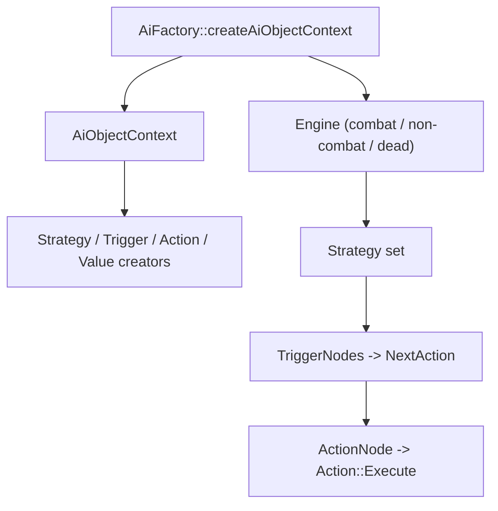
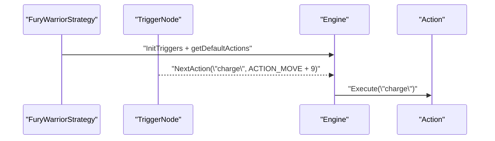

# 3 — AI architecture

This page focuses on the **AI building blocks** used across the module: context, engine, strategies, actions, triggers, and values.

## 3.1 — Context & Engine

**Role**
- The **AI context** (`AiObjectContext`) is the registry/factory for strategies, actions, triggers, and values.
- The **engine** (`Engine`) owns the strategy set, builds trigger/action queues, and executes the next action.

**Key APIs / classes**
- `AiFactory::createAiObjectContext` selects a class‑specific context (e.g., warrior, priest) or the base context.  
- `Engine` exposes `addStrategy`, `ChangeStrategy`, `DoNextAction`, and executes actions from the queue.  
- Contexts and factories live under `src/Bot/Engine/` and `src/Bot/Factory/`.

**Managed data**
- Shared context lists for strategies/actions/triggers/values inside `AiObjectContext`.
- Runtime engine state: strategies, triggers, multipliers, action queue, last action.

**Extension points**
- Add a new **strategy** class and register it in the appropriate `AiObjectContext` or a class‑specific context.
- Add a **new action/trigger/value** and expose it via the context creators.
- Override or customize default strategy composition via `AiFactory` (combat/non‑combat/dead engines).

## 3.2 — Strategies

**Role**
- A **strategy** is a bundle of triggers, default actions, and multipliers that define behavior in a context (combat, non‑combat, raid, etc.).

**Key APIs / classes**
- `Strategy` defines `getDefaultActions`, `InitTriggers`, `InitMultipliers`, and `getName`.  
- Strategies have a type mask (e.g., combat, tank, heal) and can inject **action node factories**.

**Managed data**
- The strategy’s own `actionNodeFactories` list.
- Trigger lists populated at init time by `InitTriggers`.

**Extension points**
- Create a new `Strategy` subclass and register it in a context.
- Add action node factories for composite actions (prerequisites, alternatives, continuers).

## 3.3 — Actions

**Role**
- **Actions** are executable behaviors (cast, move, attack, loot, travel, etc.).
- **ActionNode** links an action name to prerequisites, alternatives, and continuers.

**Key APIs / classes**
- `Action::Execute`, `isPossible`, `isUseful`, and relevance metadata.  
- `ActionNode` holds a name and lists of `NextAction` entries.  
- `NextAction` is the engine’s action candidate with a relevance score.

**Managed data**
- Action relevance and the action node dependencies (prereq/alt/continue).

**Extension points**
- Add a new `Action` subclass and register it in the context.
- Use `ActionNode` factories to provide fallback paths and preconditions.

## 3.4 — Triggers

**Role**
- **Triggers** are conditions that decide when actions should be queued.
- **TriggerNode** wraps a trigger name and a list of `NextAction` handlers.

**Key APIs / classes**
- `Trigger::IsActive` + optional `getHandlers`.
- `TriggerNode` merges static handlers with `trigger->getHandlers()`.

**Managed data**
- Trigger check interval and last check time (for throttling).

**Extension points**
- Implement a new `Trigger` and register it in the context.
- Add trigger nodes in a strategy’s `InitTriggers` method.

## 3.5 — Values

**Role**
- **Values** are cached data providers used by triggers/actions (targets, distances, statuses, etc.).

**Key APIs / classes**
- `Value<T>` interface and `CalculatedValue<T>` with a check interval.
- `UntypedValue` base for context storage and serialization.

**Managed data**
- Cached value + last check time, which reduces recomputation.

**Extension points**
- Implement a new `CalculatedValue<T>` and register it in the context.
- Use existing values in triggers/actions before creating new ones.

## 3.6 — Concrete example (Fury warrior combat behavior)

Below is a **real example** showing how a strategy assembles behavior using actions, triggers, and priorities.

**1) Strategy provides action nodes**
- `FuryWarriorStrategy` adds an action‑node factory that defines composite actions like `charge`, `pummel`, and `intercept` with alternatives/prerequisites.

**2) Strategy defines default actions**
- The default action list includes `bloodthirst`, `whirlwind`, `sunder armor`, `execute`, and `melee` with descending relevance.

**3) Strategy registers triggers**
- Triggers like **enemy out of melee** enqueue `charge`, and **pummel** triggers enqueue interrupts with `ACTION_INTERRUPT` relevance.

**4) Engine executes**
- The engine merges trigger handlers + default actions and executes the highest‑relevance action.

**Relevant code references**
- Strategy base: `Strategy` class and action priorities.  
- Action primitives: `Action`, `ActionNode`, `NextAction`.  
- Trigger primitives: `Trigger`, `TriggerNode`.  
- Example strategy: `FuryWarriorStrategy` (action nodes, default actions, triggers).