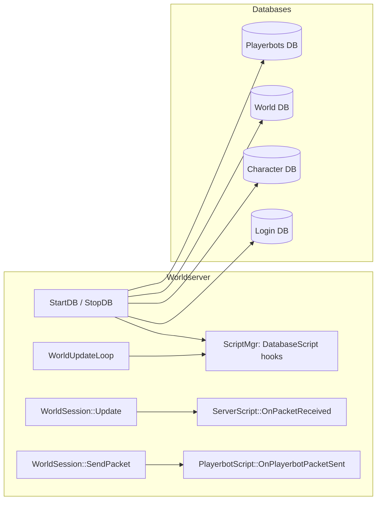
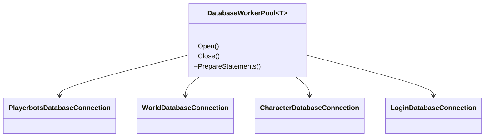
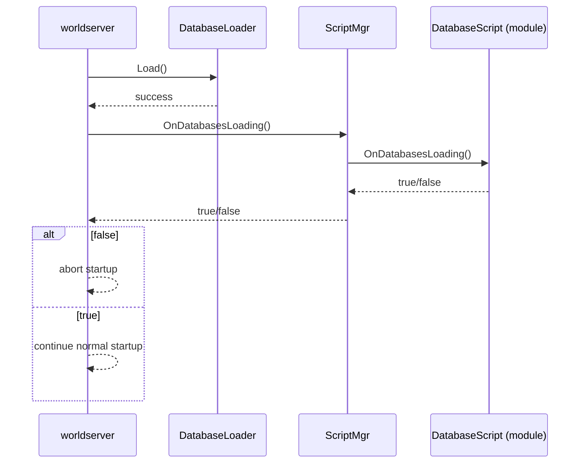
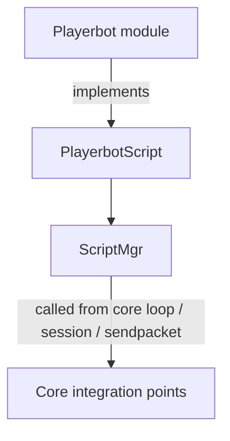
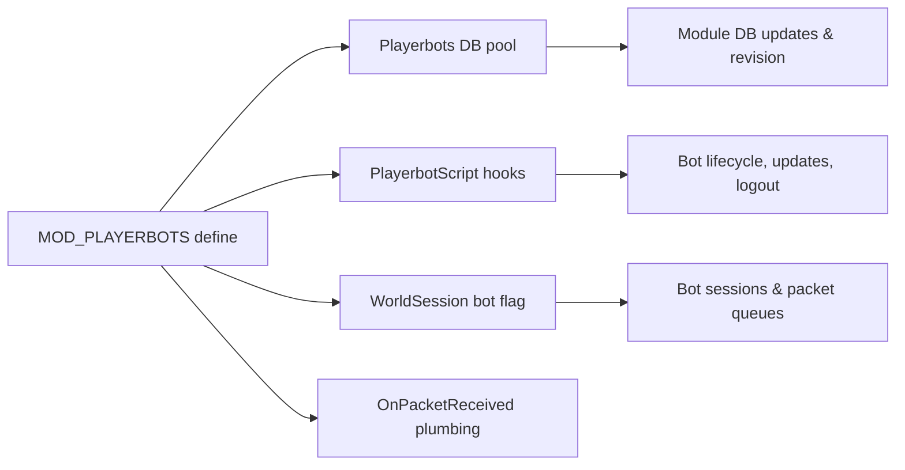

# AzerothCore core changes required by mod‑playerbots

This page documents the **AzerothCore (WotLK 3.3.5a)** changes that were introduced in the `Playerbot` core branch to support **mod‑playerbots**.

> **Scope:** this is **not** a full playerbots feature doc. It only covers the *core‑level integration points* the module relies on.

## Why a core fork is needed

AzerothCore modules usually integrate cleanly using the public API surface (scripts, hooks, DB, etc.).  
mod‑playerbots needs additional integration points that are **not available in upstream core**:

- A dedicated **Playerbots database pool** (separate connection, prepared statements, updates, revision reporting).
- Extra **ScriptMgr hook points** (database lifecycle, bot session lifecycle, packet visibility).
- A way to **tag sessions as “bot”** and intercept packets for bots without breaking normal players.
- Minor movement/spline adjustments used by bot movement logic.

## High‑level architecture

## Build system integration (MOD_PLAYERBOTS)

The core build is extended so that when the mod‑playerbots module is present, the build defines `MOD_PLAYERBOTS` and links the mysql target into modules.

**What changes**
- Detect presence of mod‑playerbots in the module list.
- Add `-DMOD_PLAYERBOTS` compile option to relevant targets.
- Ensure modules link against mysql (needed by additional DB wiring).

This means core code can safely compile the playerbots‑specific additions behind `#ifdef MOD_PLAYERBOTS` without impacting vanilla setups.

## Playerbots database: new DB pool and loader support

mod‑playerbots uses its own schema (commonly `acore_playerbots`) and needs an independent connection pool.

**What changes**
- Add `DatabaseWorkerPool<PlayerbotsDatabaseConnection> PlayerbotsDatabase` (guarded by `MOD_PLAYERBOTS`).
- Forward declarations, aliases, and helpers for:
  - `PlayerbotsDatabasePreparedStatement`
  - `PlayerbotsDatabaseTransaction`
  - `PlayerbotsDatabaseQueryHolder`
- Extend `DatabaseLoader` with:
  - a new update flag `DATABASE_PLAYERBOTS`
  - `DATABASE_MASK_ALL` including playerbots when enabled
  - `SetUpdateFlags()` to allow extending flags dynamically
  - explicit template instantiation for `AddDatabase<PlayerbotsDatabaseConnection>()`

**Developer note**
All playerbots DB wiring is compiled only when `MOD_PLAYERBOTS` is defined, so upstream behavior stays unchanged.

## Database lifecycle hooks (new DatabaseScript API)

To integrate the extra DB and keep DB lifecycle logic module‑driven, new hooks are added:

**New DatabaseScript virtual methods**
- `bool OnDatabasesLoading()` (gate startup; return false to abort)
- `void OnDatabasesKeepAlive()`
- `void OnDatabasesClosing()`
- `void OnDatabaseWarnAboutSyncQueries(bool apply)`
- `void OnDatabaseSelectIndexLogout(Player* player, uint32& statementIndex, uint32& statementParam)`
- `void OnDatabaseGetDBRevision(std::string& revision)`

**Worldserver integration**
- After `loader.Load()` succeeds, call `sScriptMgr->OnDatabasesLoading()` and abort startup if it returns false.
- On shutdown (`StopDB()`), call `sScriptMgr->OnDatabasesClosing()`.
- When toggling sync‑query warnings in the world loop, forward `apply=true/false` to scripts.

## Logging: dedicated playerbots logger

`worldserver.conf.dist` is extended to provide:
- `Appender.Playerbots=... Playerbots.log`
- `Logger.playerbots=... Console Playerbots`

This allows the module to emit high‑volume bot logs without polluting `Server.log`.

## New PlayerbotScript hook family

A dedicated script type is added for playerbots lifecycle and checks:

**ScriptMgr additions (PlayerbotScript)**
- `bool OnPlayerbotCheckLFGQueue(lfg::Lfg5Guids const& guidsList)`
- `void OnPlayerbotCheckKillTask(Player* player, Unit* victim)`
- `void OnPlayerbotCheckPetitionAccount(Player* player, bool& found)`
- `bool OnPlayerbotCheckUpdatesToSend(Player* player)`
- `void OnPlayerbotPacketSent(Player* player, WorldPacket const* packet)`
- `void OnPlayerbotUpdate(uint32 diff)`
- `void OnPlayerbotUpdateSessions(Player* player)`
- `void OnPlayerbotLogout(Player* player)`
- `void OnPlayerbotLogoutBots()`

A new file introduces the script registration boilerplate:
- `src/server/game/Scripting/ScriptDefines/PlayerbotsScript.cpp`

## ServerScript: packet visibility (OnPacketReceived)

To let modules observe inbound packets (for bot control, debug, filtering, etc.), `ServerScript` is extended:

**What changes**
- New virtual: `void OnPacketReceived(WorldSession* session, WorldPacket const& packet)`
- `ScriptMgr::OnPacketReceived()` copies the packet and forwards to scripts.
- `WorldSession::Update()` calls `sScriptMgr->OnPacketReceived(this, *packet)` behind `#ifdef MOD_PLAYERBOTS`.

This stays opt‑in for modules and avoids changing the existing `CanPacketReceive()` contract.

## WorldSession changes: bot‑aware sessions + extra safety

**Bot flag**
- `WorldSession` constructor gains a `bool isBot` parameter and stores it in `_isBot`.
- If the session is a bot and not a real socket session, address is set to `"bot"`.
- Added:
  - `bool IsBot() const`
  - `void SetAddress(std::string const& address)`
  - `LockedQueue<WorldPacket*>& GetPacketQueue()` (exposed for module‑side session control)

**SendPacket instrumentation & safety**
- If `packet->GetOpcode() == NULL_OPCODE`, log an error and return (prevents silent bad packets).
- Call `sScriptMgr->OnPlayerbotPacketSent(GetPlayer(), packet)` before sending.

## WorldSessionMgr shutdown hook

On `KickAll()` (including offline sessions), call:
- `sScriptMgr->OnPlayerbotLogoutBots()` behind `#ifdef MOD_PLAYERBOTS`.

## Player update and chat hooks (PlayerScript)

Additional `PlayerScript` hooks are introduced:
- `OnPlayerAfterUpdate(Player*, uint32)`
- Chat‑related hooks:
  - `OnChat`
  - `OnChatWithReceiver`
  - `OnChatWithGroup`
  - `OnChatWithGuild`
  - `OnChatWithChannel`

These allow bots to integrate with chat parsing / command routing and post‑update logic.

## Movement: reverse spline orientation support

`PointMovementGenerator<T>::DoInitialize()` is extended:
- If `_reverseOrientation` is set, `MoveSplineInit::SetOrientationInversed()` is called.

This is used by playerbots movement behaviors that must invert orientation without rewriting spline logic.

## Quick “What depends on what?” map

## Operational checklist (server owner)

- Use the Playerbot core branch (or apply the equivalent patch‑set).
- Build with the module enabled so `MOD_PLAYERBOTS` gets defined.
- Configure the playerbots DB connection (commonly `acore_playerbots`).
- Ensure `Logger.playerbots` and `Appender.Playerbots` are present (or add them).
- Apply playerbots DB updates (module provides SQL updates).
- Start worldserver and confirm:
- Playerbots DB loads and revision is reported (if implemented by the module).
- Playerbots log file is created.