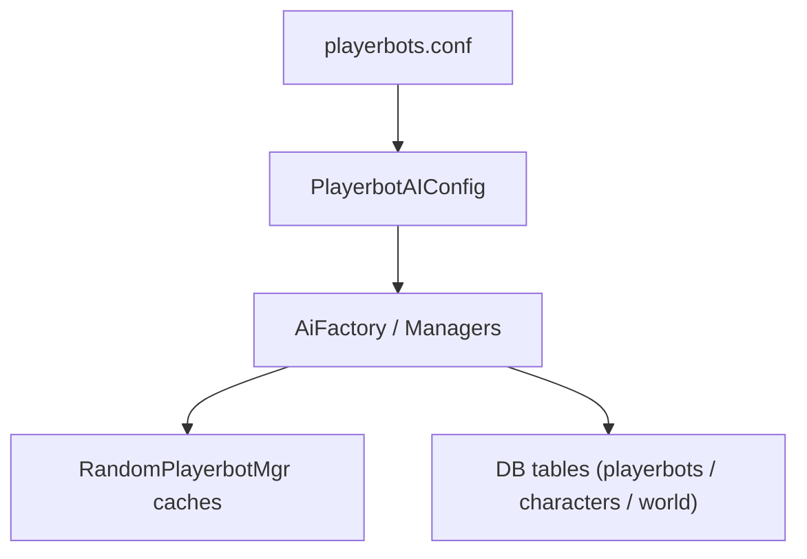

# 5 — Data & configuration architecture

**Deliverable:** a complete mapping of configs & data (config file, DB tables, runtime caches/state).

This page describes **where data lives** and **how it is loaded** for the playerbots module.

## 5.1 — `playerbots.conf` and key variables

**Primary file**
- `conf/playerbots.conf.dist` (copied to `playerbots.conf` by the server admin).

**Key configuration areas (high‑level)**
- **Enablement & random bots**
  - `AiPlayerbot.Enabled`
  - `AiPlayerbot.RandomBotAutologin`
  - `AiPlayerbot.MinRandomBots` / `AiPlayerbot.MaxRandomBots`
  - `AiPlayerbot.DisabledWithoutRealPlayer` + login/logout delays
- **Player‑controlled bots**
  - `AiPlayerbot.MaxAddedBots`
  - `AiPlayerbot.AllowAccountBots`, `AiPlayerbot.AllowGuildBots`, `AiPlayerbot.AllowTrustedAccountBots`
  - `AiPlayerbot.AddClassCommand` + `AiPlayerbot.AddClassAccountPoolSize`
- **Behavior & timing**
  - Timers, distances, thresholds, combat and strategy sections
  - Random bot strategies, RPG strategy, and teleport sections

**Notes**
- The file is large and categorized; keep edits within the correct section.
- Configuration is loaded once on world initialization (`PlayerbotAIConfig`).

## 5.2 — Database tables used by the module

Tables are shipped in **`data/sql/*/base/`** and updated in **`data/sql/playerbots/updates/`**.

### Playerbots module database (`data/sql/playerbots/base/`)

**Core data & state**
- `playerbots_random_bots`
- `playerbots_db_store`
- `playerbots_custom_strategy`

**Accounts & permissions**
- `playerbots_account_type`
- `playerbots_account_keys`
- `playerbots_account_links`

**Speech / text**
- `ai_playerbot_texts`
- `ai_playerbot_texts_chance`
- `playerbots_speech`
- `playerbots_speech_probability`

**Travel & movement**
- `playerbots_travelnode`
- `playerbots_travelnode_path`
- `playerbots_travelnode_link`
- `playerbots_tele_cache`

**Items & gear**
- `playerbots_item_info_cache`
- `playerbots_rnditem_cache`
- `playerbots_rarity_cache`
- `playerbots_enchants`
- `playerbots_equip_cache`
- `playerbots_preferred_mounts`
- `playerbots_weightscales`
- `playerbots_weightscale_data`

**Dungeon suggestions**
- `playerbots_dungeon_suggestion_definition`
- `playerbots_dungeon_suggestion_abbrevation`
- `playerbots_dungeon_suggestion_strategy`

**Guild tasks**
- `playerbots_guild_tasks`

### Characters database (`data/sql/characters/base/`)

- `playerbots_names`
- `playerbots_guild_names`
- `playerbots_arena_team_names`

### World database (`data/sql/world/base/`)

- `playerbots_rpg_races`

## 5.3 — Runtime data (caches, flags, transient state)

**Random bot manager caches**
- `BattlegroundData`, `VisualBots`, `Supporters`, `LfgDungeons`
- `BattleMastersCache`, `eventCache`
- Travel/teleport caches: `locsPerLevelCache`, `allianceStarterPerLevelCache`, `hordeStarterPerLevelCache`,
  `bankerLocsPerLevelCache`, `zone2LevelBracket`, `rpgLocsCacheLevel`

**Transient state**
- Bot session queues and login throttling timers
- `currentBots`, `players`, and in‑memory bot maps

**Why it matters**
- These caches reduce DB cost but must be refreshed carefully to avoid stale behavior.
- Use existing managers (`RandomPlayerbotMgr`, `TravelMgr`) rather than duplicating cache logic.

