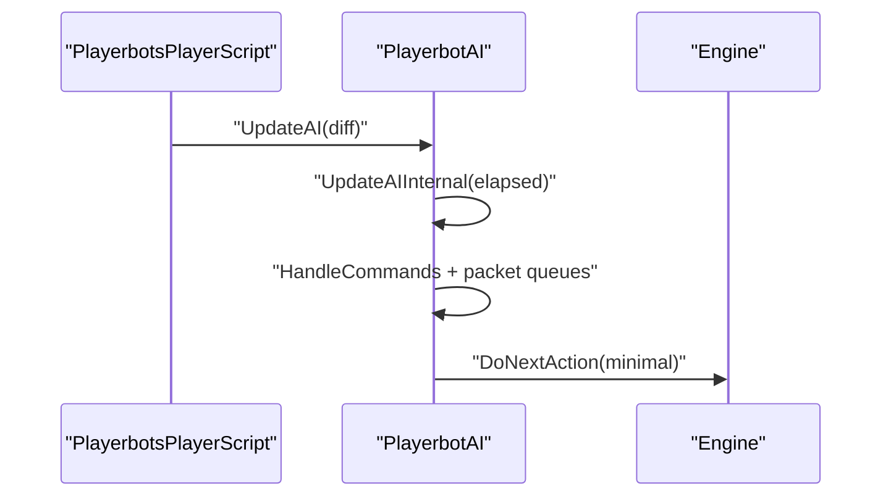
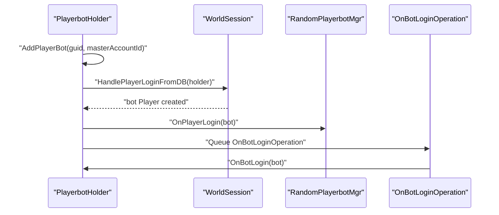
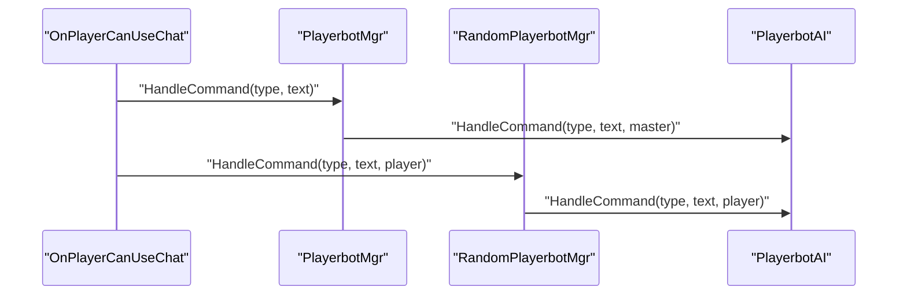
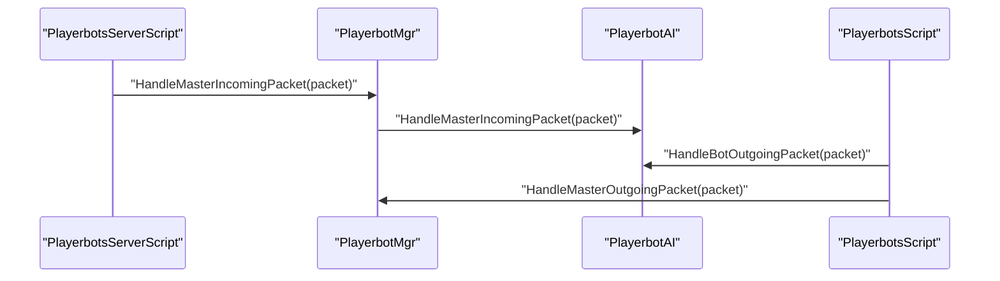
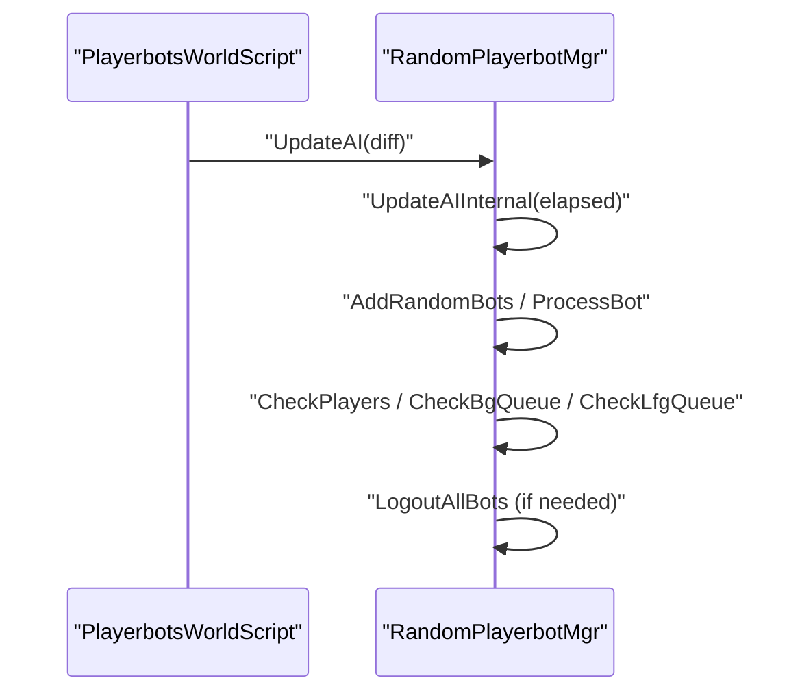

# 2 — Major execution flows

This page documents the **runtime flows** that most contributors need to understand first: the per‑bot update loop, login/attach, command routing, packet routing, and random bot lifecycle. All flows are based on the current code in `src/Bot/` and `src/Script/`.

## 2.1 — AI tick (UpdateAI → UpdateAIInternal → DoNextAction)

**Entry points**
- `PlayerbotsPlayerScript::OnPlayerAfterUpdate` calls `PlayerbotAI::UpdateAI(diff)` for bots.  
- `PlayerbotAI::UpdateAI(uint32 elapsed, bool minimal)` is the per‑bot tick function.

**Flow (text sequence)**
1. `PlayerbotAI::UpdateAI` applies early exits (session/world/teleport/logout checks) and timing gates.
2. It applies optional cheat‑driven fixes (health/power).
3. It validates `CanUpdateAI()` and handles current spell state checks.
4. It calls `UpdateAIInternal(elapsed, minimal)`.
5. `UpdateAIInternal` processes queued chat/commands, logout logic, and packet queues.
6. It ends with `DoNextAction(minimal)` which delegates to the current engine.

## 2.2 — Bot login / attach flow (master bots and random bots)

**Entry points**
- `PlayerbotHolder::AddPlayerBot(ObjectGuid, masterAccountId)` starts login for a bot.  
- Login completion goes through `PlayerbotHolder::HandlePlayerBotLoginCallback`.

**Flow (text sequence)**
1. `AddPlayerBot` validates permissions (account/guild/linked/addclass rules) and queues a login query holder.
2. The login callback creates a `WorldSession` and calls `HandlePlayerLoginFromDB`.
3. The bot is registered via `sRandomPlayerbotMgr.OnPlayerLogin(bot)`.
4. An `OnBotLoginOperation` is queued in the world thread processor.
5. `OnBotLoginOperation::Execute` selects the correct holder (random vs master‑bound) and calls `holder->OnBotLogin(bot)`.
6. `PlayerbotHolder::OnBotLogin` adds the bot to `playerBots` and calls `OnBotLoginInternal`.

## 2.3 — Player command → bot (chat and channel routing)

**Entry points**
- Chat hooks in `PlayerbotsPlayerScript::OnPlayerCanUseChat` handle whisper, group, guild, and channel messages.
- `PlayerbotMgr::HandleCommand` dispatches to all master‑controlled bots.
- `RandomPlayerbotMgr::HandleCommand` dispatches to random bots.

**Flow (text sequence)**
1. A player sends chat (whisper/group/guild/channel).
2. The hook detects a bot recipient and calls `HandleCommand`.
3. `PlayerbotMgr::HandleCommand` splits by command separator and forwards to `PlayerbotAI::HandleCommand`.
4. `RandomPlayerbotMgr::HandleCommand` forwards to `PlayerbotAI::HandleCommand` for random bots.

## 2.4 — Packet routing (master ↔ bot)

**Entry points**
- `PlayerbotsServerScript::OnPacketReceived` routes **incoming** packets to the master’s `PlayerbotMgr`.
- `PlayerbotsScript::OnPlayerbotPacketSent` routes **outgoing** packets to bot AI and master manager.

**Flow (text sequence)**
1. Incoming master packets are forwarded to each bot AI via `HandleMasterIncomingPacket`.
2. Outgoing bot packets are captured and forwarded via `HandleBotOutgoingPacket` and `HandleMasterOutgoingPacket`.

## 2.5 — Random bot lifecycle (world tick, login/logout, queues)

**Entry points**
- `PlayerbotsWorldScript::OnUpdate` runs the world‑thread tick.
- `RandomPlayerbotMgr::UpdateAIInternal` orchestrates the random bot lifecycle.

**Flow (text sequence)**
1. `OnUpdate` calls `sRandomPlayerbotMgr.UpdateAI(diff)` (world thread).
2. `UpdateAIInternal` computes target bot counts and (if allowed) triggers logins via `AddRandomBots`.
3. It periodically checks players, BG queue, and LFG queue timers.
4. It calls `ProcessBot` for updates and logins.
5. It triggers logouts (`LogoutAllBots`) when required by configuration or no real players online.

