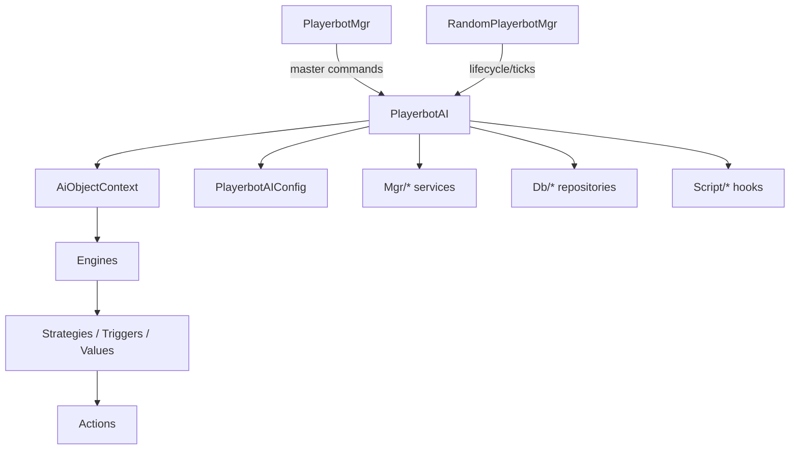

# High-level architecture

This page captures the macro architecture of the module and serves as a stable entry point for new contributors.

## 1.A — Macro component map (final)

### Core entry points and orchestrators

| Component | Responsibility | Primary location |
| --- | --- | --- |
| **PlayerbotAI** | Per-bot decision controller. Owns the AI context and switches between combat / non-combat / dead engines. | `src/Bot/PlayerbotAI.*` |
| **PlayerbotMgr** | Manages bots linked to a real player (chat/command routing, login/logout). | `src/Bot/PlayerbotMgr.*` |
| **RandomPlayerbotMgr** | Manages autonomous bots (population, lifecycle, scheduling). | `src/Bot/RandomPlayerbotMgr.*` |
| **PlayerbotAIConfig** | Centralized configuration and tunables loaded at server startup. | `src/PlayerbotAIConfig.*` |

### AI decision stack (inside one bot)

| Layer | Responsibility | Primary location |
| --- | --- | --- |
| **AiObjectContext** | Registry/factory for actions, triggers, values, strategies. | `src/Bot/Factory/` |
| **Engines** | Combat / non-combat / dead engines that execute strategies and actions. | `src/Bot/Engine/` |
| **Strategies** | Behavior bundles that add triggers and actions. | `src/Ai/` |
| **Actions** | Atomic behaviors executed by the engine (cast, move, loot, travel). | `src/Ai/` |
| **Triggers & Values** | Conditions and data providers that decide which actions run. | `src/Ai/` |

### Supporting systems (shared services)

| System | Responsibility | Primary location |
| --- | --- | --- |
| **TravelMgr** | Travel destinations, RPG locations, routing helpers for movement. | `src/Mgr/Travel/` |
| **Guild / Item / Move / Security / Talent / Text** | Cross-cutting managers used by AI logic. | `src/Mgr/` |
| **Repositories & caches** | Data access and precomputed caches for AI decisions. | `src/Db/` |
| **Scripts** | AzerothCore script hooks and module wiring. | `src/Script/` |

### High-level interaction diagram

## 1.B — Roles and interactions

> This section is the first concrete deliverable: a written macro map that can later be converted into a diagram.

### Core components (entry points)

- **PlayerbotAI** — main decision engine for a bot instance.  
  Location: `src/Bot/PlayerbotAI.h` / `src/Bot/PlayerbotAI.cpp`.
- **PlayerbotMgr** — manages bots linked to a master player (commands, packets, login/logout).  
  Location: `src/Bot/PlayerbotMgr.h` / `src/Bot/PlayerbotMgr.cpp`.
- **RandomPlayerbotMgr** — manages autonomous/random bots (lifecycle, scheduling, stats).  
  Location: `src/Bot/RandomPlayerbotMgr.h` / `src/Bot/RandomPlayerbotMgr.cpp`.
- **PlayerbotAIConfig** — centralized configuration and tunables for bot behavior.  
  Location: `src/PlayerbotAIConfig.h` / `src/PlayerbotAIConfig.cpp`.

### High-level responsibilities

- **AI decision flow:** `PlayerbotAI` orchestrates decision-making and behavior for a single bot.
- **Master-bound bots:** `PlayerbotMgr` handles player-controlled bots and their command interface.
- **Random bots:** `RandomPlayerbotMgr` handles autonomous bots and their lifecycle policies.
- **Configuration:** `PlayerbotAIConfig` provides shared settings and timing values.

### Directory overview (macro)

- `src/Bot/` — core bot AI, managers, and command handling.
- `src/Ai/` — AI logic (strategies, actions, triggers, class-specific behavior).
- `src/Mgr/` — manager helpers and cross‑cutting systems.
- `src/Db/` — data access and persistence logic.
- `src/Util/` — shared utilities.

### Interaction sketch (textual)

1. **Bot login** enters via `PlayerbotMgr` or `RandomPlayerbotMgr`.
2. A **PlayerbotAI** instance is associated with the bot player.
3. **Update cycles** call into AI decisions.
4. **Configuration** values from `PlayerbotAIConfig` guide timing and behaviors.

## 1.C — Notes for diagram (confirmed from code)

- **AI engine construction & strategy injection**
  - `PlayerbotAI::PlayerbotAI(Player* bot)` creates the **AI context** via
    `AiFactory::createAiObjectContext`, then builds the **combat**, **non-combat**, and **dead**
    engines with `AiFactory::createCombatEngine`, `createNonCombatEngine`, and `createDeadEngine`.
  - Each engine is built by `AiFactory` where default strategies are attached
    (`AddDefaultCombatStrategies`, `AddDefaultNonCombatStrategies`, `AddDefaultDeadStrategies`),
    then `Engine::Init()` finalizes the setup.
- **Update tick entry point**
  - `PlayerbotAI::UpdateAI` is the per-bot tick function; it gates updates (state checks, cheats),
    then calls `UpdateAIInternal`.
  - `PlayerbotAI::UpdateAIInternal` handles queued packets, commands, and ends with
    `DoNextAction(minimal)` which drives the action selection/dispatch.
  - Manager ticks: `PlayerbotMgr::UpdateAIInternal` runs error notification timers for master-bound bots,
    while `RandomPlayerbotMgr::UpdateAIInternal` manages random bot lifecycle, counts, and scheduling.
- **Random bot data stores (state/queues/caches)**
  - **Battle/queue tracking:** `BattlegroundData`, `VisualBots`, `Supporters`, `LfgDungeons`.
  - **Caching:** `BattleMastersCache`, `eventCache`, `rpgLocsCacheLevel`, `zone2LevelBracket`,
    `locsPerLevelCache`, `allianceStarterPerLevelCache`, `hordeStarterPerLevelCache`,
    `bankerLocsPerLevelCache`, `addclassCache`.
  - **Runtime lists:** `players`, `currentBots`, plus inherited `playerBots` from `PlayerbotHolder`.