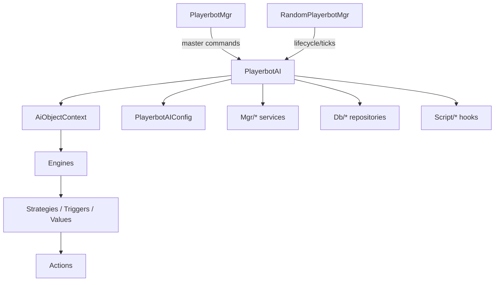
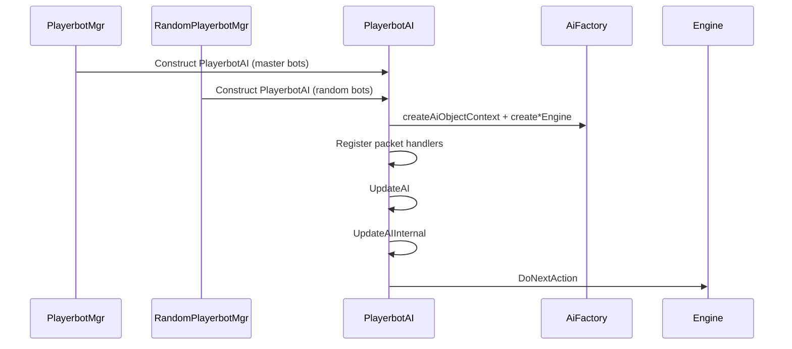

# High-level architecture

## 1.A — Macro component map

### Core entry points and orchestrators

| Component | Responsibility | Primary location |
| --- | --- | --- |
| **PlayerbotAI** | Per-bot decision controller. Owns the AI context and switches between combat / non-combat / dead engines. | `src/Bot/PlayerbotAI.*` |
| **PlayerbotMgr** | Manages bots linked to a real player (chat/command routing, login/logout). | `src/Bot/PlayerbotMgr.*` |
| **RandomPlayerbotMgr** | Manages autonomous bots (population, lifecycle, scheduling). | `src/Bot/RandomPlayerbotMgr.*` |
| **PlayerbotAIConfig** | Centralized configuration and tunables loaded at server startup. | `src/PlayerbotAIConfig.*` |

### AI decision stack (inside one bot)

| Layer | Responsibility | Primary location |
| --- | --- | --- |
| **AiObjectContext** | Registry/factory for actions, triggers, values, strategies. | `src/Bot/Factory/` |
| **Engines** | Combat / non-combat / dead engines that execute strategies and actions. | `src/Bot/Engine/` |
| **Strategies** | Behavior bundles that add triggers and actions. | `src/Ai/` |
| **Actions** | Atomic behaviors executed by the engine (cast, move, loot, travel). | `src/Ai/` |
| **Triggers & Values** | Conditions and data providers that decide which actions run. | `src/Ai/` |

### Supporting systems (shared services)

| System | Responsibility | Primary location |
| --- | --- | --- |
| **TravelMgr** | Travel destinations, RPG locations, routing helpers for movement. | `src/Mgr/Travel/` |
| **Guild / Item / Move / Security / Talent / Text** | Cross-cutting managers used by AI logic. | `src/Mgr/` |
| **Repositories & caches** | Data access and precomputed caches for AI decisions. | `src/Db/` |
| **Scripts** | AzerothCore script hooks and module wiring. | `src/Script/` |

### High-level interaction diagram

## 1.B — Roles and interactions

### PlayerbotAI — per-bot AI core

- **Construction and AI wiring**
  - Each bot builds an `AiObjectContext`, then creates three engines (combat, non-combat, dead) through
    `AiFactory::createCombatEngine`, `createNonCombatEngine`, and `createDeadEngine`. The current engine starts
    in non-combat by default.  
  - Packet handlers for master incoming/outgoing and bot outgoing queues are registered during construction.
- **Per-tick AI loop**
  - `PlayerbotAI::UpdateAI` prepares state and calls `UpdateAIInternal`.
  - `UpdateAIInternal` processes queued chat replies, runs `HandleCommands`, handles logout rules, then processes
    packet handler queues and ends with `DoNextAction(minimal)` to execute the engine decision.
- **Packet queues / handlers**
  - **masterIncomingPacketHandlers**: parses master-to-bot packets (game object use, taxi, quest, etc.).
  - **masterOutgoingPacketHandlers**: forwards bot-related responses back to the master (party/raid events, quest
    details).
  - **botOutgoingPacketHandlers**: observes bot->server responses and triggers AI reactions (loot, trade, BG/LFG).
- **Master management**
  - `UpdateAIGroupMaster` enforces group/master rules, including reassigning masters for random bots when necessary.
- **Logout logic (inside `UpdateAIInternal`)**
  - If the bot session is logging out, the AI checks `ShouldLogOut()` and multiple fast-exit cases:
    - bot or master resting, in flight, or master session permissions allow instant logout.
  - If logout is confirmed, the bot is logged out via `PlayerbotMgr::LogoutPlayerBot` (master bots) or
    `RandomPlayerbotMgr::LogoutPlayerBot` (random bots), and the tick exits early.

### PlayerbotMgr — master-bound bot orchestration

- **Command fan-out**
  - `PlayerbotMgr::HandleCommand` splits multi-commands and forwards them to each bot AI (including random bots
    currently bound to the same master).
- **Packet fan-out**
  - `PlayerbotMgr::HandleMasterIncomingPacket` forwards master packets to each bot AI and reacts to login/logout
    opcodes by logging bots in or out.
- **Periodic update**
  - `PlayerbotMgr::UpdateAIInternal` only maintains error notifications and timing, deferring AI decisions to
    each bot’s `PlayerbotAI` instance.

### RandomPlayerbotMgr — autonomous population manager

- **Population control**
  - `RandomPlayerbotMgr::UpdateAIInternal` computes target bot counts, manages login/logout, and schedules which bots
    will be updated on each cycle.
- **Queue integrations**
  - The same update loop triggers background checks for BG and LFG queues based on configured timers.
- **Bot processing**
  - Selected bots are processed via `ProcessBot`, which decides whether to update an online bot or log in a new one.

### Interaction sketch (textual, consolidated)

1. **Bot creation / login**: `PlayerbotMgr` or `RandomPlayerbotMgr` brings a bot online and constructs `PlayerbotAI`.
2. **AI wiring**: `PlayerbotAI` builds `AiObjectContext`, initializes engines, and registers packet handlers.
3. **Per-tick**: `PlayerbotAI::UpdateAI` → `UpdateAIInternal` → `DoNextAction` drives decision-making.
4. **Master commands**: `PlayerbotMgr::HandleCommand` fans out text commands to bot AIs.
5. **Autonomous lifecycle**: `RandomPlayerbotMgr::UpdateAIInternal` schedules bot updates and logins.

### Mini timeline (who calls who)

### Flow table (core interactions)

| Trigger | Orchestrator | Key calls | Outcome |
| --- | --- | --- | --- |
| Master chat command | `PlayerbotMgr` | `HandleCommand` → `PlayerbotAI::HandleCommand` | Bot strategy/action update |
| Bot tick | `PlayerbotAI` | `UpdateAI` → `UpdateAIInternal` → `DoNextAction` | Action selection and execution |
| Master packet | `PlayerbotMgr` | `HandleMasterIncomingPacket` → `PlayerbotAI::HandleMasterIncomingPacket` | Bot reacts to master |
| Random bot tick | `RandomPlayerbotMgr` | `UpdateAIInternal` → `ProcessBot` | Update existing bots / login new bots |

## 1.C — Notes for diagram

- **AI engine construction & strategy injection**
  - `PlayerbotAI::PlayerbotAI(Player* bot)` creates the **AI context** with
    `AiFactory::createAiObjectContext`, then builds the **combat**, **non-combat**, and **dead**
    engines using `AiFactory::createCombatEngine`, `createNonCombatEngine`, and `createDeadEngine`.
  - Each engine is assembled in `AiFactory`, where default strategies are attached
    (`AddDefaultCombatStrategies`, `AddDefaultNonCombatStrategies`, `AddDefaultDeadStrategies`),
    followed by `Engine::Init()` to finalize triggers and actions.
- **Update tick entry point**
  - `PlayerbotAI::UpdateAI` is the per-bot tick. It runs early guards (world/session state, transport),
    updates group/master state, and then calls `UpdateAIInternal`.
  - `PlayerbotAI::UpdateAIInternal` processes chat replies, runs `HandleCommands`, applies logout rules,
    processes packet handler queues, then calls `DoNextAction(minimal)` to dispatch the next AI action.
  - Manager ticks: `PlayerbotMgr::UpdateAIInternal` handles master-bot error reporting timers, while
    `RandomPlayerbotMgr::UpdateAIInternal` drives random-bot population updates and scheduling.
- **Random bot data stores (state/queues/caches)**
  - **Battle/queue tracking:** `BattlegroundData`, `VisualBots`, `Supporters`, `LfgDungeons`.
  - **Caching:** `BattleMastersCache`, `eventCache`, `rpgLocsCacheLevel`, `zone2LevelBracket`,
    `locsPerLevelCache`, `allianceStarterPerLevelCache`, `hordeStarterPerLevelCache`,
    `bankerLocsPerLevelCache`, `addclassCache`.
  - **Runtime lists:** `players`, `currentBots`, plus inherited `playerBots` from `PlayerbotHolder`.