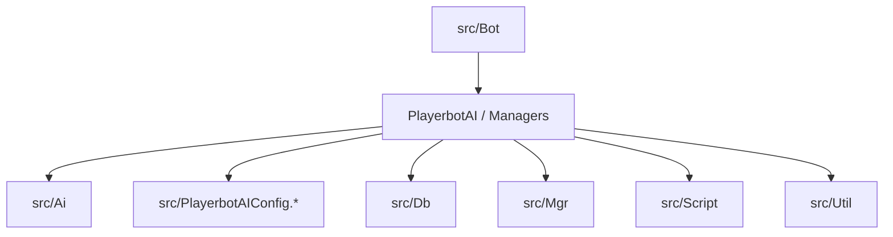

# Playerbots Documentation

This site hosts the architecture documentation for the `mod-playerbots` module. The content is built progressively to
keep it approachable for new contributors.

## Architecture Plan (Phased)

This document is a roadmap to produce a **progressive** and **approachable** architecture overview of
`mod-playerbots`, designed for developers who are new to the module. The goal is to move in short, validated phases
to reach a complete, maintainable architecture plan.

### Goals

- Understand the **main components** and their responsibilities.
- Map the **major execution flows** (login, AI tick, commands, random bots).
- Document **safe extension points** (actions, strategies, etc.).
- Identify **key dependencies** with AzerothCore and its conventions.
- Create a document that speeds up onboarding and reduces risky changes.

### Phase 0 — Preparation (1–2 hours)

**Deliverable:** a documentation outline and an initial glossary.

#### 0.A — Folder map (main roles)

| Folder | Role |
| --- | --- |
| `src/Ai/` | AI logic: strategies, actions, triggers, values, class/dungeon/raid specializations. |
| `src/Bot/` | Bot core: `PlayerbotAI`, bot managers, bot engine factories, command handling. |
| `src/Db/` | Data access and persistence logic for playerbots. |
| `src/Mgr/` | Managers and cross‑cutting systems (services used across bot subsystems). |
| `src/Script/` | Script bindings/integration points with AzerothCore. |
| `src/Util/` | Shared utility helpers used across the module. |
| `src/PlayerbotAIConfig.*` | Central configuration and tunables for bot behavior. |

#### 0.B — Glossary (initial)

- **Bot**: A character controlled by `PlayerbotAI` instead of a human player.
- **Master**: The real player controlling one or more bots via commands (linked to `PlayerbotMgr`).
- **Random bot**: Autonomous bot managed by `RandomPlayerbotMgr` (not tied to a master).
- **Strategy**: A behavior bundle registered into an `Engine` (e.g., combat or non‑combat).
- **Action**: A single executable behavior chosen by the `Engine` (cast, move, loot, etc.).
- **Trigger**: A condition that selects which action should run.
- **Value**: A data provider used by triggers/actions (cached computation).
- **Engine**: The decision dispatcher that runs strategies, evaluates triggers, and executes actions.
- **Context (AiObjectContext)**: Factory + registry for actions, triggers, values, and strategies.

#### 0.C — Common section format (for all later pages)

Use this structure for every component or subsystem page:

1. **Role**  
   What the component does and when it is used.
2. **Key APIs / classes**  
   The entry points and main classes/functions.
3. **Managed data**  
   State, caches, DB tables, or configuration it owns.
4. **Extension points**  
   Where new logic can be added safely.
5. **Risks / pitfalls**  
   Common mistakes, performance costs, or side effects.

### Phase 1 — High-level overview (1–2 days)

**Deliverable:** a macro diagram + introduction page.

1. **Macro component map**
   - `PlayerbotAI`: decision core.
   - `PlayerbotMgr`: bots linked to a master player.
   - `RandomPlayerbotMgr`: autonomous bots.
   - `PlayerbotAIConfig`: configuration.
2. **Roles and interactions** (diagram or clear list).
3. **AzerothCore dependencies** (e.g., use of Unit/Player helpers).

#### Phase 1 draft (initial macro map)

> This section is the first concrete deliverable: a written macro map that can later be converted into a diagram.

##### Core components (entry points)

- **PlayerbotAI** — main decision engine for a bot instance.  
  Location: `src/Bot/PlayerbotAI.h` / `src/Bot/PlayerbotAI.cpp`.
- **PlayerbotMgr** — manages bots linked to a master player (commands, packets, login/logout).  
  Location: `src/Bot/PlayerbotMgr.h` / `src/Bot/PlayerbotMgr.cpp`.
- **RandomPlayerbotMgr** — manages autonomous/random bots (lifecycle, scheduling, stats).  
  Location: `src/Bot/RandomPlayerbotMgr.h` / `src/Bot/RandomPlayerbotMgr.cpp`.
- **PlayerbotAIConfig** — centralized configuration and tunables for bot behavior.  
  Location: `src/PlayerbotAIConfig.h` / `src/PlayerbotAIConfig.cpp`.

##### High-level responsibilities

- **AI decision flow:** `PlayerbotAI` orchestrates decision-making and behavior for a single bot.
- **Master-bound bots:** `PlayerbotMgr` handles player-controlled bots and their command interface.
- **Random bots:** `RandomPlayerbotMgr` handles autonomous bots and their lifecycle policies.
- **Configuration:** `PlayerbotAIConfig` provides shared settings and timing values.

##### Directory overview (macro)

- `src/Bot/` — core bot AI, managers, and command handling.
- `src/Ai/` — AI logic (strategies, actions, triggers, class-specific behavior).
- `src/Mgr/` — manager helpers and cross-cutting systems.
- `src/Db/` — data access and persistence logic.
- `src/Util/` — shared utilities.

##### Interaction sketch (textual)

1. **Bot login** enters via `PlayerbotMgr` or `RandomPlayerbotMgr`.
2. A **PlayerbotAI** instance is associated with the bot player.
3. **Update cycles** call into AI decisions.
4. **Configuration** values from `PlayerbotAIConfig` guide timing and behaviors.

##### Notes for diagram (confirmed from code)

- **AI engine construction & strategy injection**
  - `PlayerbotAI::PlayerbotAI(Player* bot)` creates the **AI context** via
    `AiFactory::createAiObjectContext`, then builds the **combat**, **non-combat**, and **dead**
    engines with `AiFactory::createCombatEngine`, `createNonCombatEngine`, and `createDeadEngine`.
  - Each engine is built by `AiFactory` where default strategies are attached
    (`AddDefaultCombatStrategies`, `AddDefaultNonCombatStrategies`, `AddDefaultDeadStrategies`),
    then `Engine::Init()` finalizes the setup.
- **Update tick entry point**
  - `PlayerbotAI::UpdateAI` is the per-bot tick function; it gates updates (state checks, cheats),
    then calls `UpdateAIInternal`.
  - `PlayerbotAI::UpdateAIInternal` handles queued packets, commands, and ends with
    `DoNextAction(minimal)` which drives the action selection/dispatch.
  - Manager ticks: `PlayerbotMgr::UpdateAIInternal` runs error notification timers for master-bound bots,
    while `RandomPlayerbotMgr::UpdateAIInternal` manages random bot lifecycle, counts, and scheduling.
- **Random bot data stores (state/queues/caches)**
  - **Battle/queue tracking:** `BattlegroundData`, `VisualBots`, `Supporters`, `LfgDungeons`.
  - **Caching:** `BattleMastersCache`, `eventCache`, `rpgLocsCacheLevel`, `zone2LevelBracket`,
    `locsPerLevelCache`, `allianceStarterPerLevelCache`, `hordeStarterPerLevelCache`,
    `bankerLocsPerLevelCache`, `addclassCache`.
  - **Runtime lists:** `players`, `currentBots`, plus inherited `playerBots` from `PlayerbotHolder`.

### Phase 2 — Major execution flows (2–4 days)

**Deliverable:** 3–5 sequence diagrams (or pseudo-sequences).

1. **Bot login**
2. **AI tick (UpdateAIInternal)**
3. **Player command → bot**
4. **Random bot lifecycle (spawn, behavior, logout)**

Each flow should answer:
- Who triggers it?
- Which class orchestrates it?
- Which subsystems are called?
- Which states change?

#### Phase 2.1 — AI tick (UpdateAI → UpdateAIInternal → DoNextAction)

**Goal:** describe the per-bot execution loop that drives decisions and actions.

**Entry point**
- `PlayerbotAI::UpdateAI(uint32 elapsed, bool minimal)` is called each tick for a bot.

**Flow (text sequence)**
1. `PlayerbotAI::UpdateAI` applies timing gates and early exits (session/world/teleport/logging out).
2. It applies cheat-driven state fixes (health/power) when enabled.
3. It validates `CanUpdateAI()` and handles current spell checks (interrupts, facing, transport checks).
4. It calls `UpdateAIInternal(elapsed, minimal)`.
5. `UpdateAIInternal` processes chat replies and pending commands.
6. It handles logout logic (session conditions, master checks) and exits if needed.
7. It processes packet queues (bot outgoing, master incoming/outgoing).
8. It ends with `DoNextAction(minimal)` which delegates to the engine to pick/execute actions.

**Key notes**
- `UpdateAIInternal` is the main dispatcher for **command handling** and **action selection**.
- `DoNextAction` is where the current `Engine` drives the next action.

### Phase 3 — AI architecture (1–2 weeks)

**Deliverable:** a detailed map of AI modules and extension points.

1. **Context / Engine**
2. **Strategies**
3. **Actions**
4. **Triggers**
5. **Values**

Goal: explain how a behavior is assembled, with one concrete example.

### Phase 4 — Gameplay-specific systems (2–4 weeks)

**Deliverable:** dedicated sections for complex systems.

- Pathfinding / Movement
- Combat (melee/ranged/heal)
- Group / Raid logic
- LFG / BG / Arena
- Random bot RPG logic

### Phase 5 — Data & configuration architecture (1 week)

**Deliverable:** a complete mapping of configs & data.

- `playerbots.conf` and key variables
- DB tables used by the module
- Runtime data (caches, flags, transient state)

### Phase 6 — Quick contribution guide (1 week)

**Deliverable:** a "first patch" guide.

1. Where to make a safe small change
2. Where **not** to modify first
3. How to test locally
4. "PR-ready" checklist

### Expected final outcome

A document (or wiki) that contains:
- High-level overview
- Main execution flows
- Detailed AI architecture
- Gameplay-specific systems
- Configs & data
- Contribution guide

### Practical advice (working solo)

1. **Timebox** each phase (even 2 hours per week helps).
2. Document **as you read** the code.
3. Do not aim for perfection: keep a "Open Questions" section.
4. Revisit each phase after 1–2 weeks of distance.
