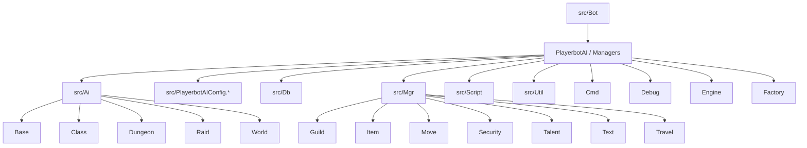

# Module map & glossary (Phase 0)

**Deliverable:** a documentation outline and an initial glossary.

## Module map (folders & roles)

| Folder | Role |
| --- | --- |
| `src/Ai/` | AI logic: strategies, actions, triggers, values, class/dungeon/raid/world specializations. |
| `src/Bot/` | Bot core: `PlayerbotAI`, bot managers, engine factories, command handling. |
| `src/Db/` | Data access and persistence logic for playerbots. |
| `src/Mgr/` | Managers and cross‑cutting systems (services used across bot subsystems). |
| `src/Script/` | Script bindings/integration points with AzerothCore. |
| `src/Util/` | Shared utility helpers used across the module. |
| `src/PlayerbotAIConfig.*` | Central configuration and tunables for bot behavior. |

### `src/Ai/` (subfolders)

- `Base/` — shared base AI logic (actions, triggers, values).
- `Class/` — class-specific AI logic.
- `Dungeon/` — dungeon-specific strategies/triggers/actions.
- `Raid/` — raid-specific strategies/triggers/actions.
- `World/` — world/overworld behavior logic.

### `src/Bot/` (subfolders + key files)

- `Cmd/` — command handling helpers.
- `Debug/` — debugging utilities for bots.
- `Engine/` — decision engine core (strategies/actions orchestration).
- `Factory/` — AI context/engine factories and default strategy wiring.
- `PlayerbotAI.*` — main bot AI entry point.
- `PlayerbotMgr.*` — master-bound bot manager.
- `RandomPlayerbotMgr.*` — random bot manager.

### `src/Db/` (repositories/caches)

- `FlightMasterCache.*`
- `PlayerbotDungeonRepository.*`
- `PlayerbotRepository.*`
- `PlayerbotSpellRepository.*`

### `src/Mgr/` (subfolders)

- `Guild/`
- `Item/`
- `Move/`
- `Security/`
- `Talent/`
- `Text/`
- `Travel/`

### `src/Script/` (scripts)

- `PlayerbotCommandScript.*`
- `Playerbots.*`
- `PlayerbotsSecureLogin.*`
- `playerbots_loader.cpp`
- `WorldThr/`

### `src/Util/` (helpers)

- `BroadcastHelper.*`
- `Helpers.*`
- `LazyCalculatedValue.h`
- `PlaceholderHelper.*`
- `ServerFacade.*`

## Detailed file index (current repository)

> Generated from the current repository layout to avoid manual searching.

<details>
<summary><strong>src/ (top-level files)</strong></summary>

```
src/PlayerbotAIConfig.cpp
src/PlayerbotAIConfig.h
```
</details>

<details>
<summary><strong>src/Bot/ (all files)</strong></summary>

```
src/Bot/Cmd/ChatFilter.cpp
src/Bot/Cmd/ChatFilter.h
src/Bot/Cmd/ChatHelper.cpp
src/Bot/Cmd/ChatHelper.h
src/Bot/Cmd/PlayerbotCommandServer.cpp
src/Bot/Cmd/PlayerbotCommandServer.h
src/Bot/Debug/PerfMonitor.cpp
src/Bot/Debug/PerfMonitor.h
src/Bot/Engine/Action/Action.cpp
src/Bot/Engine/Action/Action.h
src/Bot/Engine/AiObject.cpp
src/Bot/Engine/AiObject.h
src/Bot/Engine/AiObjectContext.cpp
src/Bot/Engine/AiObjectContext.h
src/Bot/Engine/Engine.cpp
src/Bot/Engine/Engine.h
src/Bot/Engine/ExternalEventHelper.cpp
src/Bot/Engine/ExternalEventHelper.h
src/Bot/Engine/Multiplier.h
src/Bot/Engine/NamedObjectContext.cpp
src/Bot/Engine/NamedObjectContext.h
src/Bot/Engine/PassiveMultiplier.cpp
src/Bot/Engine/PassiveMultiplier.h
src/Bot/Engine/PlayerbotAIAware.h
src/Bot/Engine/PlayerbotAIBase.cpp
src/Bot/Engine/PlayerbotAIBase.h
src/Bot/Engine/Strategy/CustomStrategy.cpp
src/Bot/Engine/Strategy/CustomStrategy.h
src/Bot/Engine/Strategy/Strategy.cpp
src/Bot/Engine/Strategy/Strategy.h
src/Bot/Engine/Trigger/Trigger.cpp
src/Bot/Engine/Trigger/Trigger.h
src/Bot/Engine/Value/Value.cpp
src/Bot/Engine/Value/Value.h
src/Bot/Engine/WorldPacket/Event.cpp
src/Bot/Engine/WorldPacket/Event.h
src/Bot/Factory/AiFactory.cpp
src/Bot/Factory/AiFactory.h
src/Bot/Factory/PlayerbotFactory.cpp
src/Bot/Factory/PlayerbotFactory.h
src/Bot/Factory/RandomPlayerbotFactory.cpp
src/Bot/Factory/RandomPlayerbotFactory.h
src/Bot/PlayerbotAI.cpp
src/Bot/PlayerbotAI.h
src/Bot/PlayerbotMgr.cpp
src/Bot/PlayerbotMgr.h
src/Bot/RandomPlayerbotMgr.cpp
src/Bot/RandomPlayerbotMgr.h
```
</details>

<details>
<summary><strong>src/Db/ (all files)</strong></summary>

```
src/Db/FlightMasterCache.cpp
src/Db/FlightMasterCache.h
src/Db/PlayerbotDungeonRepository.cpp
src/Db/PlayerbotDungeonRepository.h
src/Db/PlayerbotRepository.cpp
src/Db/PlayerbotRepository.h
src/Db/PlayerbotSpellRepository.cpp
src/Db/PlayerbotSpellRepository.h
```
</details>

<details>
<summary><strong>src/Mgr/ (all files)</strong></summary>

```
src/Mgr/Guild/GuildTaskMgr.cpp
src/Mgr/Guild/GuildTaskMgr.h
src/Mgr/Guild/PlayerbotGuildMgr.cpp
src/Mgr/Guild/PlayerbotGuildMgr.h
src/Mgr/Item/ItemVisitors.cpp
src/Mgr/Item/ItemVisitors.h
src/Mgr/Item/LootObjectStack.cpp
src/Mgr/Item/LootObjectStack.h
src/Mgr/Item/RandomItemMgr.cpp
src/Mgr/Item/RandomItemMgr.h
src/Mgr/Item/StatsCollector.cpp
src/Mgr/Item/StatsCollector.h
src/Mgr/Item/StatsWeightCalculator.cpp
src/Mgr/Item/StatsWeightCalculator.h
src/Mgr/Move/FleeManager.cpp
src/Mgr/Move/FleeManager.h
src/Mgr/Security/PlayerbotSecurity.cpp
src/Mgr/Security/PlayerbotSecurity.h
src/Mgr/Talent/Talentspec.cpp
src/Mgr/Talent/Talentspec.h
src/Mgr/Text/PlayerbotTextMgr.cpp
src/Mgr/Text/PlayerbotTextMgr.h
src/Mgr/Travel/TravelMgr.cpp
src/Mgr/Travel/TravelMgr.h
src/Mgr/Travel/TravelNode.cpp
src/Mgr/Travel/TravelNode.h
```
</details>

<details>
<summary><strong>src/Script/ (all files)</strong></summary>

```
src/Script/PlayerbotCommandScript.cpp
src/Script/PlayerbotCommandScript.h
src/Script/Playerbots.cpp
src/Script/Playerbots.h
src/Script/PlayerbotsSecureLogin.cpp
src/Script/WorldThr/PlayerbotOperation.h
src/Script/WorldThr/PlayerbotOperations.h
src/Script/WorldThr/PlayerbotWorldThreadProcessor.cpp
src/Script/WorldThr/PlayerbotWorldThreadProcessor.h
src/Script/WorldThr/Queue.cpp
src/Script/WorldThr/Queue.h
src/Script/playerbots_loader.cpp
```
</details>

<details>
<summary><strong>src/Util/ (all files)</strong></summary>

```
src/Util/BroadcastHelper.cpp
src/Util/BroadcastHelper.h
src/Util/Helpers.cpp
src/Util/Helpers.h
src/Util/LazyCalculatedValue.h
src/Util/PlaceholderHelper.cpp
src/Util/PlaceholderHelper.h
src/Util/ServerFacade.cpp
src/Util/ServerFacade.h
```
</details>

<details>
<summary><strong>src/Ai/Base/ (all files)</strong></summary>

```
src/Ai/Base/ActionContext.h
src/Ai/Base/Actions/AcceptBattlegroundInvitationAction.cpp
src/Ai/Base/Actions/AcceptBattlegroundInvitationAction.h
src/Ai/Base/Actions/AcceptDuelAction.cpp
src/Ai/Base/Actions/AcceptDuelAction.h
src/Ai/Base/Actions/AcceptInvitationAction.cpp
src/Ai/Base/Actions/AcceptInvitationAction.h
src/Ai/Base/Actions/AcceptQuestAction.cpp
src/Ai/Base/Actions/AcceptQuestAction.h
src/Ai/Base/Actions/AcceptResurrectAction.cpp
src/Ai/Base/Actions/AcceptResurrectAction.h
src/Ai/Base/Actions/AddLootAction.cpp
src/Ai/Base/Actions/AddLootAction.h
src/Ai/Base/Actions/AreaTriggerAction.cpp
src/Ai/Base/Actions/AreaTriggerAction.h
src/Ai/Base/Actions/ArenaTeamActions.cpp
src/Ai/Base/Actions/ArenaTeamActions.h
src/Ai/Base/Actions/AttackAction.cpp
src/Ai/Base/Actions/AttackAction.h
src/Ai/Base/Actions/AutoMaintenanceOnLevelupAction.cpp
src/Ai/Base/Actions/AutoMaintenanceOnLevelupAction.h
src/Ai/Base/Actions/BankAction.cpp
src/Ai/Base/Actions/BankAction.h
src/Ai/Base/Actions/BattleGroundJoinAction.cpp
src/Ai/Base/Actions/BattleGroundJoinAction.h
src/Ai/Base/Actions/BattleGroundTactics.cpp
src/Ai/Base/Actions/BattleGroundTactics.h
src/Ai/Base/Actions/BossAuraActions.cpp
src/Ai/Base/Actions/BossAuraActions.h
src/Ai/Base/Actions/BuffAction.cpp
src/Ai/Base/Actions/BuffAction.h
src/Ai/Base/Actions/BuyAction.cpp
src/Ai/Base/Actions/BuyAction.h
src/Ai/Base/Actions/CancelChannelAction.cpp
src/Ai/Base/Actions/CancelChannelAction.h
src/Ai/Base/Actions/CastCustomSpellAction.cpp
src/Ai/Base/Actions/CastCustomSpellAction.h
src/Ai/Base/Actions/ChangeChatAction.cpp
src/Ai/Base/Actions/ChangeChatAction.h
src/Ai/Base/Actions/ChangeStrategyAction.cpp
src/Ai/Base/Actions/ChangeStrategyAction.h
src/Ai/Base/Actions/ChangeTalentsAction.cpp
src/Ai/Base/Actions/ChangeTalentsAction.h
src/Ai/Base/Actions/ChatShortcutActions.cpp
src/Ai/Base/Actions/ChatShortcutActions.h
src/Ai/Base/Actions/CheatAction.cpp
src/Ai/Base/Actions/CheatAction.h
src/Ai/Base/Actions/CheckMailAction.cpp
src/Ai/Base/Actions/CheckMailAction.h
src/Ai/Base/Actions/CheckMountStateAction.cpp
src/Ai/Base/Actions/CheckMountStateAction.h
src/Ai/Base/Actions/CheckValuesAction.cpp
src/Ai/Base/Actions/CheckValuesAction.h
src/Ai/Base/Actions/ChooseRpgTargetAction.cpp
src/Ai/Base/Actions/ChooseRpgTargetAction.h
src/Ai/Base/Actions/ChooseTargetActions.cpp
src/Ai/Base/Actions/ChooseTargetActions.h
src/Ai/Base/Actions/ChooseTravelTargetAction.cpp
src/Ai/Base/Actions/ChooseTravelTargetAction.h
src/Ai/Base/Actions/CombatActions.cpp
src/Ai/Base/Actions/CombatActions.h
src/Ai/Base/Actions/CustomStrategyEditAction.cpp
src/Ai/Base/Actions/CustomStrategyEditAction.h
src/Ai/Base/Actions/DebugAction.cpp
src/Ai/Base/Actions/DebugAction.h
src/Ai/Base/Actions/DelayAction.cpp
src/Ai/Base/Actions/DelayAction.h
src/Ai/Base/Actions/DestroyItemAction.cpp
src/Ai/Base/Actions/DestroyItemAction.h
src/Ai/Base/Actions/DropQuestAction.cpp
src/Ai/Base/Actions/DropQuestAction.h
src/Ai/Base/Actions/EmoteAction.cpp
src/Ai/Base/Actions/EmoteAction.h
src/Ai/Base/Actions/EquipAction.cpp
src/Ai/Base/Actions/EquipAction.h
src/Ai/Base/Actions/EquipGlyphsAction.cpp
src/Ai/Base/Actions/EquipGlyphsAction.h
src/Ai/Base/Actions/FishingAction.cpp
src/Ai/Base/Actions/FishingAction.h
src/Ai/Base/Actions/FlagAction.cpp
src/Ai/Base/Actions/FlagAction.h
src/Ai/Base/Actions/FollowActions.cpp
src/Ai/Base/Actions/FollowActions.h
src/Ai/Base/Actions/GenericActions.cpp
src/Ai/Base/Actions/GenericActions.h
src/Ai/Base/Actions/GenericBuffUtils.cpp
src/Ai/Base/Actions/GenericBuffUtils.h
src/Ai/Base/Actions/GenericSpellActions.cpp
src/Ai/Base/Actions/GenericSpellActions.h
src/Ai/Base/Actions/GiveItemAction.cpp
src/Ai/Base/Actions/GiveItemAction.h
src/Ai/Base/Actions/GoAction.cpp
src/Ai/Base/Actions/GoAction.h
src/Ai/Base/Actions/GossipHelloAction.cpp
src/Ai/Base/Actions/GossipHelloAction.h
src/Ai/Base/Actions/GreetAction.cpp
src/Ai/Base/Actions/GreetAction.h
src/Ai/Base/Actions/GuildAcceptAction.cpp
src/Ai/Base/Actions/GuildAcceptAction.h
src/Ai/Base/Actions/GuildBankAction.cpp
src/Ai/Base/Actions/GuildBankAction.h
src/Ai/Base/Actions/GuildCreateActions.cpp
src/Ai/Base/Actions/GuildCreateActions.h
src/Ai/Base/Actions/GuildManagementActions.cpp
src/Ai/Base/Actions/GuildManagementActions.h
src/Ai/Base/Actions/HelpAction.cpp
src/Ai/Base/Actions/HelpAction.h
src/Ai/Base/Actions/HireAction.cpp
src/Ai/Base/Actions/HireAction.h
src/Ai/Base/Actions/ImbueAction.cpp
src/Ai/Base/Actions/ImbueAction.h
src/Ai/Base/Actions/InventoryAction.cpp
src/Ai/Base/Actions/InventoryAction.h
src/Ai/Base/Actions/InventoryChangeFailureAction.cpp
src/Ai/Base/Actions/InventoryChangeFailureAction.h
src/Ai/Base/Actions/InviteToGroupAction.cpp
src/Ai/Base/Actions/InviteToGroupAction.h
src/Ai/Base/Actions/LeaveGroupAction.cpp
src/Ai/Base/Actions/LeaveGroupAction.h
src/Ai/Base/Actions/LfgActions.cpp
src/Ai/Base/Actions/LfgActions.h
src/Ai/Base/Actions/ListQuestsActions.cpp
src/Ai/Base/Actions/ListQuestsActions.h
src/Ai/Base/Actions/ListSpellsAction.cpp
src/Ai/Base/Actions/ListSpellsAction.h
src/Ai/Base/Actions/LogLevelAction.cpp
src/Ai/Base/Actions/LogLevelAction.h
src/Ai/Base/Actions/LootAction.cpp
src/Ai/Base/Actions/LootAction.h
src/Ai/Base/Actions/LootRollAction.cpp
src/Ai/Base/Actions/LootRollAction.h
src/Ai/Base/Actions/LootStrategyAction.cpp
src/Ai/Base/Actions/LootStrategyAction.h
src/Ai/Base/Actions/MailAction.cpp
src/Ai/Base/Actions/MailAction.h
src/Ai/Base/Actions/MoveToRpgTargetAction.cpp
src/Ai/Base/Actions/MoveToRpgTargetAction.h
src/Ai/Base/Actions/MoveToTravelTargetAction.cpp
src/Ai/Base/Actions/MoveToTravelTargetAction.h
src/Ai/Base/Actions/MovementActions.cpp
src/Ai/Base/Actions/MovementActions.h
src/Ai/Base/Actions/NonCombatActions.cpp
src/Ai/Base/Actions/NonCombatActions.h
src/Ai/Base/Actions/OpenItemAction.cpp
src/Ai/Base/Actions/OpenItemAction.h
src/Ai/Base/Actions/OutfitAction.cpp
src/Ai/Base/Actions/OutfitAction.h
src/Ai/Base/Actions/PassLeadershipToMasterAction.cpp
src/Ai/Base/Actions/PassLeadershipToMasterAction.h
src/Ai/Base/Actions/PetitionSignAction.cpp
src/Ai/Base/Actions/PetitionSignAction.h
src/Ai/Base/Actions/PetsAction.cpp
src/Ai/Base/Actions/PetsAction.h
src/Ai/Base/Actions/PositionAction.cpp
src/Ai/Base/Actions/PositionAction.h
src/Ai/Base/Actions/QueryItemUsageAction.cpp
src/Ai/Base/Actions/QueryItemUsageAction.h
src/Ai/Base/Actions/QueryQuestAction.cpp
src/Ai/Base/Actions/QueryQuestAction.h
src/Ai/Base/Actions/QuestAction.cpp
src/Ai/Base/Actions/QuestAction.h
src/Ai/Base/Actions/QuestConfirmAcceptAction.cpp
src/Ai/Base/Actions/QuestConfirmAcceptAction.h
src/Ai/Base/Actions/RandomBotUpdateAction.cpp
src/Ai/Base/Actions/RandomBotUpdateAction.h
src/Ai/Base/Actions/RangeAction.cpp
src/Ai/Base/Actions/RangeAction.h
src/Ai/Base/Actions/ReachTargetActions.cpp
src/Ai/Base/Actions/ReachTargetActions.h
src/Ai/Base/Actions/ReadyCheckAction.cpp
src/Ai/Base/Actions/ReadyCheckAction.h
src/Ai/Base/Actions/ReleaseSpiritAction.cpp
src/Ai/Base/Actions/ReleaseSpiritAction.h
src/Ai/Base/Actions/RememberTaxiAction.cpp
src/Ai/Base/Actions/RememberTaxiAction.h
src/Ai/Base/Actions/RemoveAuraAction.cpp
src/Ai/Base/Actions/RemoveAuraAction.h
src/Ai/Base/Actions/RepairAllAction.cpp
src/Ai/Base/Actions/RepairAllAction.h
src/Ai/Base/Actions/ResetAiAction.cpp
src/Ai/Base/Actions/ResetAiAction.h
src/Ai/Base/Actions/ResetInstancesAction.cpp
src/Ai/Base/Actions/ResetInstancesAction.h
src/Ai/Base/Actions/RevealGatheringItemAction.cpp
src/Ai/Base/Actions/RevealGatheringItemAction.h
src/Ai/Base/Actions/ReviveFromCorpseAction.cpp
src/Ai/Base/Actions/ReviveFromCorpseAction.h
src/Ai/Base/Actions/RewardAction.cpp
src/Ai/Base/Actions/RewardAction.h
src/Ai/Base/Actions/RpgAction.cpp
src/Ai/Base/Actions/RpgAction.h
src/Ai/Base/Actions/RpgSubActions.cpp
src/Ai/Base/Actions/RpgSubActions.h
src/Ai/Base/Actions/RpgValues.h
src/Ai/Base/Actions/RtiAction.cpp
src/Ai/Base/Actions/RtiAction.h
src/Ai/Base/Actions/RtscAction.cpp
src/Ai/Base/Actions/RtscAction.h
src/Ai/Base/Actions/SaveManaAction.cpp
src/Ai/Base/Actions/SaveManaAction.h
src/Ai/Base/Actions/SayAction.cpp
src/Ai/Base/Actions/SayAction.h
src/Ai/Base/Actions/SecurityCheckAction.cpp
src/Ai/Base/Actions/SecurityCheckAction.h
src/Ai/Base/Actions/SeeSpellAction.cpp
src/Ai/Base/Actions/SeeSpellAction.h
src/Ai/Base/Actions/SellAction.cpp
src/Ai/Base/Actions/SellAction.h
src/Ai/Base/Actions/SendMailAction.cpp
src/Ai/Base/Actions/SendMailAction.h
src/Ai/Base/Actions/SetCraftAction.cpp
src/Ai/Base/Actions/SetCraftAction.h
src/Ai/Base/Actions/SetHomeAction.cpp
src/Ai/Base/Actions/SetHomeAction.h
src/Ai/Base/Actions/ShareQuestAction.cpp
src/Ai/Base/Actions/ShareQuestAction.h
src/Ai/Base/Actions/SkipSpellsListAction.cpp
src/Ai/Base/Actions/SkipSpellsListAction.h
src/Ai/Base/Actions/StatsAction.cpp
src/Ai/Base/Actions/StatsAction.h
src/Ai/Base/Actions/StayActions.cpp
src/Ai/Base/Actions/StayActions.h
src/Ai/Base/Actions/SuggestWhatToDoAction.cpp
src/Ai/Base/Actions/SuggestWhatToDoAction.h
src/Ai/Base/Actions/TalkToQuestGiverAction.cpp
src/Ai/Base/Actions/TalkToQuestGiverAction.h
src/Ai/Base/Actions/TameAction.cpp
src/Ai/Base/Actions/TameAction.h
src/Ai/Base/Actions/TaxiAction.cpp
src/Ai/Base/Actions/TaxiAction.h
src/Ai/Base/Actions/TeleportAction.cpp
src/Ai/Base/Actions/TeleportAction.h
src/Ai/Base/Actions/TellCastFailedAction.cpp
src/Ai/Base/Actions/TellCastFailedAction.h
src/Ai/Base/Actions/TellGlyphsAction.cpp
src/Ai/Base/Actions/TellGlyphsAction.h
src/Ai/Base/Actions/TellItemCountAction.cpp
src/Ai/Base/Actions/TellItemCountAction.h
src/Ai/Base/Actions/TellLosAction.cpp
src/Ai/Base/Actions/TellLosAction.h
src/Ai/Base/Actions/TellMasterAction.cpp
src/Ai/Base/Actions/TellMasterAction.h
src/Ai/Base/Actions/TellPvpStatsAction.cpp
src/Ai/Base/Actions/TellPvpStatsAction.h
src/Ai/Base/Actions/TellReputationAction.cpp
src/Ai/Base/Actions/TellReputationAction.h
src/Ai/Base/Actions/TellTargetAction.cpp
src/Ai/Base/Actions/TellTargetAction.h
src/Ai/Base/Actions/TradeAction.cpp
src/Ai/Base/Actions/TradeAction.h
src/Ai/Base/Actions/TradeStatusAction.cpp
src/Ai/Base/Actions/TradeStatusAction.h
src/Ai/Base/Actions/TradeStatusExtendedAction.cpp
src/Ai/Base/Actions/TradeStatusExtendedAction.h
src/Ai/Base/Actions/TradeValues.cpp
src/Ai/Base/Actions/TradeValues.h
src/Ai/Base/Actions/TrainerAction.cpp
src/Ai/Base/Actions/TrainerAction.h
src/Ai/Base/Actions/TravelAction.cpp
src/Ai/Base/Actions/TravelAction.h
src/Ai/Base/Actions/UnequipAction.cpp
src/Ai/Base/Actions/UnequipAction.h
src/Ai/Base/Actions/UnlockItemAction.cpp
src/Ai/Base/Actions/UnlockItemAction.h
src/Ai/Base/Actions/UnlockTradedItemAction.cpp
src/Ai/Base/Actions/UnlockTradedItemAction.h
src/Ai/Base/Actions/UseItemAction.cpp
src/Ai/Base/Actions/UseItemAction.h
src/Ai/Base/Actions/UseMeetingStoneAction.cpp
src/Ai/Base/Actions/UseMeetingStoneAction.h
src/Ai/Base/Actions/VehicleActions.cpp
src/Ai/Base/Actions/VehicleActions.h
src/Ai/Base/Actions/WhoAction.cpp
src/Ai/Base/Actions/WhoAction.h
src/Ai/Base/Actions/WipeAction.cpp
src/Ai/Base/Actions/WipeAction.h
src/Ai/Base/Actions/WorldBuffAction.cpp
src/Ai/Base/Actions/WorldBuffAction.h
src/Ai/Base/Actions/WtsAction.cpp
src/Ai/Base/Actions/WtsAction.h
src/Ai/Base/Actions/XpGainAction.cpp
src/Ai/Base/Actions/XpGainAction.h
src/Ai/Base/ChatActionContext.h
src/Ai/Base/ChatTriggerContext.h
src/Ai/Base/SharedValueContext.h
src/Ai/Base/Strategy/AttackEnemyPlayersStrategy.cpp
src/Ai/Base/Strategy/AttackEnemyPlayersStrategy.h
src/Ai/Base/Strategy/BattlegroundStrategy.cpp
src/Ai/Base/Strategy/BattlegroundStrategy.h
src/Ai/Base/Strategy/CastTimeStrategy.cpp
src/Ai/Base/Strategy/CastTimeStrategy.h
src/Ai/Base/Strategy/ChatCommandHandlerStrategy.cpp
src/Ai/Base/Strategy/ChatCommandHandlerStrategy.h
src/Ai/Base/Strategy/CombatStrategy.cpp
src/Ai/Base/Strategy/CombatStrategy.h
src/Ai/Base/Strategy/ConserveManaStrategy.cpp
src/Ai/Base/Strategy/ConserveManaStrategy.h
src/Ai/Base/Strategy/DeadStrategy.cpp
src/Ai/Base/Strategy/DeadStrategy.h
src/Ai/Base/Strategy/DebugStrategy.cpp
src/Ai/Base/Strategy/DebugStrategy.h
src/Ai/Base/Strategy/DpsAssistStrategy.cpp
src/Ai/Base/Strategy/DpsAssistStrategy.h
src/Ai/Base/Strategy/DuelStrategy.cpp
src/Ai/Base/Strategy/DuelStrategy.h
src/Ai/Base/Strategy/EmoteStrategy.cpp
src/Ai/Base/Strategy/EmoteStrategy.h
src/Ai/Base/Strategy/FleeStrategy.cpp
src/Ai/Base/Strategy/FleeStrategy.h
src/Ai/Base/Strategy/FollowMasterStrategy.cpp
src/Ai/Base/Strategy/FollowMasterStrategy.h
src/Ai/Base/Strategy/GrindingStrategy.cpp
src/Ai/Base/Strategy/GrindingStrategy.h
src/Ai/Base/Strategy/GroupStrategy.cpp
src/Ai/Base/Strategy/GroupStrategy.h
src/Ai/Base/Strategy/GuardStrategy.cpp
src/Ai/Base/Strategy/GuardStrategy.h
src/Ai/Base/Strategy/GuildStrategy.cpp
src/Ai/Base/Strategy/GuildStrategy.h
src/Ai/Base/Strategy/KiteStrategy.cpp
src/Ai/Base/Strategy/KiteStrategy.h
src/Ai/Base/Strategy/LfgStrategy.cpp
src/Ai/Base/Strategy/LfgStrategy.h
src/Ai/Base/Strategy/LootNonCombatStrategy.cpp
src/Ai/Base/Strategy/LootNonCombatStrategy.h
src/Ai/Base/Strategy/MaintenanceStrategy.cpp
src/Ai/Base/Strategy/MaintenanceStrategy.h
src/Ai/Base/Strategy/MarkRtiStrategy.cpp
src/Ai/Base/Strategy/MarkRtiStrategy.h
src/Ai/Base/Strategy/MeleeCombatStrategy.cpp
src/Ai/Base/Strategy/MeleeCombatStrategy.h
src/Ai/Base/Strategy/MoveFromGroupStrategy.cpp
src/Ai/Base/Strategy/MoveFromGroupStrategy.h
src/Ai/Base/Strategy/NonCombatStrategy.cpp
src/Ai/Base/Strategy/NonCombatStrategy.h
src/Ai/Base/Strategy/PassTroughStrategy.cpp
src/Ai/Base/Strategy/PassTroughStrategy.h
src/Ai/Base/Strategy/PassiveStrategy.cpp
src/Ai/Base/Strategy/PassiveStrategy.h
src/Ai/Base/Strategy/PullStrategy.cpp
src/Ai/Base/Strategy/PullStrategy.h
src/Ai/Base/Strategy/QuestStrategies.cpp
src/Ai/Base/Strategy/QuestStrategies.h
src/Ai/Base/Strategy/RTSCStrategy.cpp
src/Ai/Base/Strategy/RTSCStrategy.h
src/Ai/Base/Strategy/RacialsStrategy.cpp
src/Ai/Base/Strategy/RacialsStrategy.h
src/Ai/Base/Strategy/RangedCombatStrategy.cpp
src/Ai/Base/Strategy/RangedCombatStrategy.h
src/Ai/Base/Strategy/ReturnStrategy.cpp
src/Ai/Base/Strategy/ReturnStrategy.h
src/Ai/Base/Strategy/RpgStrategy.cpp
src/Ai/Base/Strategy/RpgStrategy.h
src/Ai/Base/Strategy/RunawayStrategy.cpp
src/Ai/Base/Strategy/RunawayStrategy.h
src/Ai/Base/Strategy/SayStrategy.cpp
src/Ai/Base/Strategy/SayStrategy.h
src/Ai/Base/Strategy/StayStrategy.cpp
src/Ai/Base/Strategy/StayStrategy.h
src/Ai/Base/Strategy/TankAssistStrategy.cpp
src/Ai/Base/Strategy/TankAssistStrategy.h
src/Ai/Base/Strategy/TellTargetStrategy.cpp
src/Ai/Base/Strategy/TellTargetStrategy.h
src/Ai/Base/Strategy/ThreatStrategy.cpp
src/Ai/Base/Strategy/ThreatStrategy.h
src/Ai/Base/Strategy/TravelStrategy.cpp
src/Ai/Base/Strategy/TravelStrategy.h
src/Ai/Base/Strategy/UseFoodStrategy.cpp
src/Ai/Base/Strategy/UseFoodStrategy.h
src/Ai/Base/Strategy/UsePotionsStrategy.cpp
src/Ai/Base/Strategy/UsePotionsStrategy.h
src/Ai/Base/Strategy/WorldPacketHandlerStrategy.cpp
src/Ai/Base/Strategy/WorldPacketHandlerStrategy.h
src/Ai/Base/StrategyContext.h
src/Ai/Base/Trigger/BossAuraTriggers.cpp
src/Ai/Base/Trigger/BossAuraTriggers.h
src/Ai/Base/Trigger/ChatCommandTrigger.cpp
src/Ai/Base/Trigger/ChatCommandTrigger.h
src/Ai/Base/Trigger/CureTriggers.cpp
src/Ai/Base/Trigger/CureTriggers.h
src/Ai/Base/Trigger/FishingTriggers.cpp
src/Ai/Base/Trigger/FishingTriggers.h
src/Ai/Base/Trigger/GenericTriggers.cpp
src/Ai/Base/Trigger/GenericTriggers.h
src/Ai/Base/Trigger/GuildTriggers.cpp
src/Ai/Base/Trigger/GuildTriggers.h
src/Ai/Base/Trigger/HealthTriggers.cpp
src/Ai/Base/Trigger/HealthTriggers.h
src/Ai/Base/Trigger/LfgTriggers.cpp
src/Ai/Base/Trigger/LfgTriggers.h
src/Ai/Base/Trigger/LootTriggers.cpp
src/Ai/Base/Trigger/LootTriggers.h
src/Ai/Base/Trigger/PvpTriggers.cpp
src/Ai/Base/Trigger/PvpTriggers.h
src/Ai/Base/Trigger/RangeTriggers.cpp
src/Ai/Base/Trigger/RangeTriggers.h
src/Ai/Base/Trigger/RpgTriggers.cpp
src/Ai/Base/Trigger/RpgTriggers.h
src/Ai/Base/Trigger/RtiTriggers.cpp
src/Ai/Base/Trigger/RtiTriggers.h
src/Ai/Base/Trigger/StuckTriggers.cpp
src/Ai/Base/Trigger/StuckTriggers.h
src/Ai/Base/Trigger/TravelTriggers.cpp
src/Ai/Base/Trigger/TravelTriggers.h
src/Ai/Base/Trigger/WithinAreaTrigger.cpp
src/Ai/Base/Trigger/WithinAreaTrigger.h
src/Ai/Base/Trigger/WorldPacketTrigger.cpp
src/Ai/Base/Trigger/WorldPacketTrigger.h
src/Ai/Base/TriggerContext.h
src/Ai/Base/Value/ActiveSpellValue.cpp
src/Ai/Base/Value/ActiveSpellValue.h
src/Ai/Base/Value/AlwaysLootListValue.cpp
src/Ai/Base/Value/AlwaysLootListValue.h
src/Ai/Base/Value/AoeHealValues.cpp
src/Ai/Base/Value/AoeHealValues.h
src/Ai/Base/Value/AoeValues.cpp
src/Ai/Base/Value/AoeValues.h
src/Ai/Base/Value/Arrow.cpp
src/Ai/Base/Value/Arrow.h
src/Ai/Base/Value/AttackerCountValues.cpp
src/Ai/Base/Value/AttackerCountValues.h
src/Ai/Base/Value/AttackerWithoutAuraTargetValue.cpp
src/Ai/Base/Value/AttackerWithoutAuraTargetValue.h
src/Ai/Base/Value/AttackersValue.cpp
src/Ai/Base/Value/AttackersValue.h
src/Ai/Base/Value/AvailableLootValue.cpp
src/Ai/Base/Value/AvailableLootValue.h
src/Ai/Base/Value/BudgetValues.cpp
src/Ai/Base/Value/BudgetValues.h
src/Ai/Base/Value/CcTargetValue.cpp
src/Ai/Base/Value/CcTargetValue.h
src/Ai/Base/Value/ChatValue.h
src/Ai/Base/Value/CollisionValue.cpp
src/Ai/Base/Value/CollisionValue.h
src/Ai/Base/Value/CraftValue.h
src/Ai/Base/Value/CurrentCcTargetValue.cpp
src/Ai/Base/Value/CurrentCcTargetValue.h
src/Ai/Base/Value/CurrentTargetValue.cpp
src/Ai/Base/Value/CurrentTargetValue.h
src/Ai/Base/Value/DistanceValue.cpp
src/Ai/Base/Value/DistanceValue.h
src/Ai/Base/Value/DpsTargetValue.cpp
src/Ai/Base/Value/DpsTargetValue.h
src/Ai/Base/Value/DuelTargetValue.cpp
src/Ai/Base/Value/DuelTargetValue.h
src/Ai/Base/Value/EnemyHealerTargetValue.cpp
src/Ai/Base/Value/EnemyHealerTargetValue.h
src/Ai/Base/Value/EnemyPlayerValue.cpp
src/Ai/Base/Value/EnemyPlayerValue.h
src/Ai/Base/Value/EstimatedLifetimeValue.cpp
src/Ai/Base/Value/EstimatedLifetimeValue.h
src/Ai/Base/Value/FishValues.cpp
src/Ai/Base/Value/FishValues.h
src/Ai/Base/Value/Formations.cpp
src/Ai/Base/Value/Formations.h
src/Ai/Base/Value/GrindTargetValue.cpp
src/Ai/Base/Value/GrindTargetValue.h
src/Ai/Base/Value/GroupLeaderValue.cpp
src/Ai/Base/Value/GroupLeaderValue.h
src/Ai/Base/Value/GroupValues.cpp
src/Ai/Base/Value/GroupValues.h
src/Ai/Base/Value/GuildValues.cpp
src/Ai/Base/Value/GuildValues.h
src/Ai/Base/Value/HasAvailableLootValue.cpp
src/Ai/Base/Value/HasAvailableLootValue.h
src/Ai/Base/Value/HasTotemValue.cpp
src/Ai/Base/Value/HasTotemValue.h
src/Ai/Base/Value/InvalidTargetValue.cpp
src/Ai/Base/Value/InvalidTargetValue.h
src/Ai/Base/Value/IsBehindValue.cpp
src/Ai/Base/Value/IsBehindValue.h
src/Ai/Base/Value/IsFacingValue.cpp
src/Ai/Base/Value/IsFacingValue.h
src/Ai/Base/Value/IsMovingValue.cpp
src/Ai/Base/Value/IsMovingValue.h
src/Ai/Base/Value/ItemCountValue.cpp
src/Ai/Base/Value/ItemCountValue.h
src/Ai/Base/Value/ItemForSpellValue.cpp
src/Ai/Base/Value/ItemForSpellValue.h
src/Ai/Base/Value/ItemUsageValue.cpp
src/Ai/Base/Value/ItemUsageValue.h
src/Ai/Base/Value/LastMovementValue.cpp
src/Ai/Base/Value/LastMovementValue.h
src/Ai/Base/Value/LastSaidValue.h
src/Ai/Base/Value/LastSpellCastTimeValue.h
src/Ai/Base/Value/LastSpellCastValue.cpp
src/Ai/Base/Value/LastSpellCastValue.h
src/Ai/Base/Value/LeastHpTargetValue.cpp
src/Ai/Base/Value/LeastHpTargetValue.h
src/Ai/Base/Value/LfgValues.h
src/Ai/Base/Value/LineTargetValue.cpp
src/Ai/Base/Value/LineTargetValue.h
src/Ai/Base/Value/LogLevelValue.h
src/Ai/Base/Value/LootStrategyValue.cpp
src/Ai/Base/Value/LootStrategyValue.h
src/Ai/Base/Value/LootValues.cpp
src/Ai/Base/Value/LootValues.h
src/Ai/Base/Value/MaintenanceValues.cpp
src/Ai/Base/Value/MaintenanceValues.h
src/Ai/Base/Value/ManaSaveLevelValue.h
src/Ai/Base/Value/NearestAdsValue.cpp
src/Ai/Base/Value/NearestAdsValue.h
src/Ai/Base/Value/NearestCorpsesValue.cpp
src/Ai/Base/Value/NearestCorpsesValue.h
src/Ai/Base/Value/NearestFriendlyPlayersValue.cpp
src/Ai/Base/Value/NearestFriendlyPlayersValue.h
src/Ai/Base/Value/NearestGameObjects.cpp
src/Ai/Base/Value/NearestGameObjects.h
src/Ai/Base/Value/NearestNonBotPlayersValue.cpp
src/Ai/Base/Value/NearestNonBotPlayersValue.h
src/Ai/Base/Value/NearestNpcsValue.cpp
src/Ai/Base/Value/NearestNpcsValue.h
src/Ai/Base/Value/NearestUnitsValue.cpp
src/Ai/Base/Value/NearestUnitsValue.h
src/Ai/Base/Value/NewPlayerNearbyValue.cpp
src/Ai/Base/Value/NewPlayerNearbyValue.h
src/Ai/Base/Value/OutfitListValue.cpp
src/Ai/Base/Value/OutfitListValue.h
src/Ai/Base/Value/PartyMemberToDispel.cpp
src/Ai/Base/Value/PartyMemberToDispel.h
src/Ai/Base/Value/PartyMemberToHeal.cpp
src/Ai/Base/Value/PartyMemberToHeal.h
src/Ai/Base/Value/PartyMemberToResurrect.cpp
src/Ai/Base/Value/PartyMemberToResurrect.h
src/Ai/Base/Value/PartyMemberValue.cpp
src/Ai/Base/Value/PartyMemberValue.h
src/Ai/Base/Value/PartyMemberWithoutAuraValue.cpp
src/Ai/Base/Value/PartyMemberWithoutAuraValue.h
src/Ai/Base/Value/PartyMemberWithoutItemValue.cpp
src/Ai/Base/Value/PartyMemberWithoutItemValue.h
src/Ai/Base/Value/PetTargetValue.cpp
src/Ai/Base/Value/PetTargetValue.h
src/Ai/Base/Value/PositionValue.cpp
src/Ai/Base/Value/PositionValue.h
src/Ai/Base/Value/PossibleRpgTargetsValue.cpp
src/Ai/Base/Value/PossibleRpgTargetsValue.h
src/Ai/Base/Value/PossibleTargetsValue.cpp
src/Ai/Base/Value/PossibleTargetsValue.h
src/Ai/Base/Value/PvpValues.cpp
src/Ai/Base/Value/PvpValues.h
src/Ai/Base/Value/QuestValues.cpp
src/Ai/Base/Value/QuestValues.h
src/Ai/Base/Value/RTSCValues.cpp
src/Ai/Base/Value/RTSCValues.h
src/Ai/Base/Value/RandomBotUpdateValue.h
src/Ai/Base/Value/RangeValues.cpp
src/Ai/Base/Value/RangeValues.h
src/Ai/Base/Value/RtiTargetValue.cpp
src/Ai/Base/Value/RtiTargetValue.h
src/Ai/Base/Value/RtiValue.cpp
src/Ai/Base/Value/RtiValue.h
src/Ai/Base/Value/SelfTargetValue.cpp
src/Ai/Base/Value/SelfTargetValue.h
src/Ai/Base/Value/SkipSpellsListValue.cpp
src/Ai/Base/Value/SkipSpellsListValue.h
src/Ai/Base/Value/SnareTargetValue.cpp
src/Ai/Base/Value/SnareTargetValue.h
src/Ai/Base/Value/SpellCastUsefulValue.cpp
src/Ai/Base/Value/SpellCastUsefulValue.h
src/Ai/Base/Value/SpellIdValue.cpp
src/Ai/Base/Value/SpellIdValue.h
src/Ai/Base/Value/Stances.cpp
src/Ai/Base/Value/Stances.h
src/Ai/Base/Value/StatsValues.cpp
src/Ai/Base/Value/StatsValues.h
src/Ai/Base/Value/TankTargetValue.cpp
src/Ai/Base/Value/TankTargetValue.h
src/Ai/Base/Value/TargetValue.cpp
src/Ai/Base/Value/TargetValue.h
src/Ai/Base/Value/ThreatValues.cpp
src/Ai/Base/Value/ThreatValues.h
src/Ai/Base/ValueContext.h
src/Ai/Base/WorldPacketActionContext.h
src/Ai/Base/WorldPacketTriggerContext.h
```
</details>

<details>
<summary><strong>src/Ai/Class/ (all files)</strong></summary>

```
src/Ai/Class/Dk/Action/DKActions.cpp
src/Ai/Class/Dk/Action/DKActions.h
src/Ai/Class/Dk/DKAiObjectContext.cpp
src/Ai/Class/Dk/DKAiObjectContext.h
src/Ai/Class/Dk/Strategy/BloodDKStrategy.cpp
src/Ai/Class/Dk/Strategy/BloodDKStrategy.h
src/Ai/Class/Dk/Strategy/FrostDKStrategy.cpp
src/Ai/Class/Dk/Strategy/FrostDKStrategy.h
src/Ai/Class/Dk/Strategy/GenericDKNonCombatStrategy.cpp
src/Ai/Class/Dk/Strategy/GenericDKNonCombatStrategy.h
src/Ai/Class/Dk/Strategy/GenericDKStrategy.cpp
src/Ai/Class/Dk/Strategy/GenericDKStrategy.h
src/Ai/Class/Dk/Strategy/UnholyDKStrategy.cpp
src/Ai/Class/Dk/Strategy/UnholyDKStrategy.h
src/Ai/Class/Dk/Trigger/DKTriggers.cpp
src/Ai/Class/Dk/Trigger/DKTriggers.h
src/Ai/Class/Druid/Action/DruidActions.cpp
src/Ai/Class/Druid/Action/DruidActions.h
src/Ai/Class/Druid/Action/DruidBearActions.cpp
src/Ai/Class/Druid/Action/DruidBearActions.h
src/Ai/Class/Druid/Action/DruidCatActions.cpp
src/Ai/Class/Druid/Action/DruidCatActions.h
src/Ai/Class/Druid/Action/DruidShapeshiftActions.cpp
src/Ai/Class/Druid/Action/DruidShapeshiftActions.h
src/Ai/Class/Druid/DruidAiObjectContext.cpp
src/Ai/Class/Druid/DruidAiObjectContext.h
src/Ai/Class/Druid/Strategy/BearTankDruidStrategy.cpp
src/Ai/Class/Druid/Strategy/BearTankDruidStrategy.h
src/Ai/Class/Druid/Strategy/CasterDruidStrategy.cpp
src/Ai/Class/Druid/Strategy/CasterDruidStrategy.h
src/Ai/Class/Druid/Strategy/CatDpsDruidStrategy.cpp
src/Ai/Class/Druid/Strategy/CatDpsDruidStrategy.h
src/Ai/Class/Druid/Strategy/FeralDruidStrategy.cpp
src/Ai/Class/Druid/Strategy/FeralDruidStrategy.h
src/Ai/Class/Druid/Strategy/GenericDruidNonCombatStrategy.cpp
src/Ai/Class/Druid/Strategy/GenericDruidNonCombatStrategy.h
src/Ai/Class/Druid/Strategy/GenericDruidStrategy.cpp
src/Ai/Class/Druid/Strategy/GenericDruidStrategy.h
src/Ai/Class/Druid/Strategy/HealDruidStrategy.cpp
src/Ai/Class/Druid/Strategy/HealDruidStrategy.h
src/Ai/Class/Druid/Strategy/MeleeDruidStrategy.cpp
src/Ai/Class/Druid/Strategy/MeleeDruidStrategy.h
src/Ai/Class/Druid/Strategy/OffhealDruidCatStrategy.cpp
src/Ai/Class/Druid/Strategy/OffhealDruidCatStrategy.h
src/Ai/Class/Druid/Trigger/DruidTriggers.cpp
src/Ai/Class/Druid/Trigger/DruidTriggers.h
src/Ai/Class/Hunter/Action/HunterActions.cpp
src/Ai/Class/Hunter/Action/HunterActions.h
src/Ai/Class/Hunter/HunterAiObjectContext.cpp
src/Ai/Class/Hunter/HunterAiObjectContext.h
src/Ai/Class/Hunter/Strategy/BeastMasteryHunterStrategy.cpp
src/Ai/Class/Hunter/Strategy/BeastMasteryHunterStrategy.h
src/Ai/Class/Hunter/Strategy/GenericHunterNonCombatStrategy.cpp
src/Ai/Class/Hunter/Strategy/GenericHunterNonCombatStrategy.h
src/Ai/Class/Hunter/Strategy/GenericHunterStrategy.cpp
src/Ai/Class/Hunter/Strategy/GenericHunterStrategy.h
src/Ai/Class/Hunter/Strategy/HunterBuffStrategies.cpp
src/Ai/Class/Hunter/Strategy/HunterBuffStrategies.h
src/Ai/Class/Hunter/Strategy/MarksmanshipHunterStrategy.cpp
src/Ai/Class/Hunter/Strategy/MarksmanshipHunterStrategy.h
src/Ai/Class/Hunter/Strategy/SurvivalHunterStrategy.cpp
src/Ai/Class/Hunter/Strategy/SurvivalHunterStrategy.h
src/Ai/Class/Hunter/Trigger/HunterTriggers.cpp
src/Ai/Class/Hunter/Trigger/HunterTriggers.h
src/Ai/Class/Mage/Action/MageActions.cpp
src/Ai/Class/Mage/Action/MageActions.h
src/Ai/Class/Mage/MageAiObjectContext.cpp
src/Ai/Class/Mage/MageAiObjectContext.h
src/Ai/Class/Mage/Strategy/ArcaneMageStrategy.cpp
src/Ai/Class/Mage/Strategy/ArcaneMageStrategy.h
src/Ai/Class/Mage/Strategy/FireMageStrategy.cpp
src/Ai/Class/Mage/Strategy/FireMageStrategy.h
src/Ai/Class/Mage/Strategy/FrostFireMageStrategy.cpp
src/Ai/Class/Mage/Strategy/FrostFireMageStrategy.h
src/Ai/Class/Mage/Strategy/FrostMageStrategy.cpp
src/Ai/Class/Mage/Strategy/FrostMageStrategy.h
src/Ai/Class/Mage/Strategy/GenericMageNonCombatStrategy.cpp
src/Ai/Class/Mage/Strategy/GenericMageNonCombatStrategy.h
src/Ai/Class/Mage/Strategy/GenericMageStrategy.cpp
src/Ai/Class/Mage/Strategy/GenericMageStrategy.h
src/Ai/Class/Mage/Trigger/MageTriggers.cpp
src/Ai/Class/Mage/Trigger/MageTriggers.h
src/Ai/Class/Paladin/Action/PaladinActions.cpp
src/Ai/Class/Paladin/Action/PaladinActions.h
src/Ai/Class/Paladin/PaladinAiObjectContext.cpp
src/Ai/Class/Paladin/PaladinAiObjectContext.h
src/Ai/Class/Paladin/Strategy/DpsPaladinStrategy.cpp
src/Ai/Class/Paladin/Strategy/DpsPaladinStrategy.h
src/Ai/Class/Paladin/Strategy/GenericPaladinNonCombatStrategy.cpp
src/Ai/Class/Paladin/Strategy/GenericPaladinNonCombatStrategy.h
src/Ai/Class/Paladin/Strategy/GenericPaladinStrategy.cpp
src/Ai/Class/Paladin/Strategy/GenericPaladinStrategy.h
src/Ai/Class/Paladin/Strategy/GenericPaladinStrategyActionNodeFactory.h
src/Ai/Class/Paladin/Strategy/HealPaladinStrategy.cpp
src/Ai/Class/Paladin/Strategy/HealPaladinStrategy.h
src/Ai/Class/Paladin/Strategy/OffhealRetPaladinStrategy.cpp
src/Ai/Class/Paladin/Strategy/OffhealRetPaladinStrategy.h
src/Ai/Class/Paladin/Strategy/PaladinBuffStrategies.cpp
src/Ai/Class/Paladin/Strategy/PaladinBuffStrategies.h
src/Ai/Class/Paladin/Strategy/TankPaladinStrategy.cpp
src/Ai/Class/Paladin/Strategy/TankPaladinStrategy.h
src/Ai/Class/Paladin/Trigger/PaladinTriggers.cpp
src/Ai/Class/Paladin/Trigger/PaladinTriggers.h
src/Ai/Class/Priest/Action/PriestActions.cpp
src/Ai/Class/Priest/Action/PriestActions.h
src/Ai/Class/Priest/PriestAiObjectContext.cpp
src/Ai/Class/Priest/PriestAiObjectContext.h
src/Ai/Class/Priest/Strategy/GenericPriestStrategy.cpp
src/Ai/Class/Priest/Strategy/GenericPriestStrategy.h
src/Ai/Class/Priest/Strategy/GenericPriestStrategyActionNodeFactory.h
src/Ai/Class/Priest/Strategy/HealPriestStrategy.cpp
src/Ai/Class/Priest/Strategy/HealPriestStrategy.h
src/Ai/Class/Priest/Strategy/HolyPriestStrategy.cpp
src/Ai/Class/Priest/Strategy/HolyPriestStrategy.h
src/Ai/Class/Priest/Strategy/PriestNonCombatStrategy.cpp
src/Ai/Class/Priest/Strategy/PriestNonCombatStrategy.h
src/Ai/Class/Priest/Strategy/PriestNonCombatStrategyActionNodeFactory.h
src/Ai/Class/Priest/Strategy/ShadowPriestStrategy.cpp
src/Ai/Class/Priest/Strategy/ShadowPriestStrategy.h
src/Ai/Class/Priest/Strategy/ShadowPriestStrategyActionNodeFactory.h
src/Ai/Class/Priest/Trigger/PriestTriggers.cpp
src/Ai/Class/Priest/Trigger/PriestTriggers.h
src/Ai/Class/Rogue/Action/RogueActions.cpp
src/Ai/Class/Rogue/Action/RogueActions.h
src/Ai/Class/Rogue/Action/RogueComboActions.cpp
src/Ai/Class/Rogue/Action/RogueComboActions.h
src/Ai/Class/Rogue/Action/RogueFinishingActions.h
src/Ai/Class/Rogue/Action/RogueOpeningActions.cpp
src/Ai/Class/Rogue/Action/RogueOpeningActions.h
src/Ai/Class/Rogue/RogueAiObjectContext.cpp
src/Ai/Class/Rogue/RogueAiObjectContext.h
src/Ai/Class/Rogue/Strategy/AssassinationRogueStrategy.cpp
src/Ai/Class/Rogue/Strategy/AssassinationRogueStrategy.h
src/Ai/Class/Rogue/Strategy/DpsRogueStrategy.cpp
src/Ai/Class/Rogue/Strategy/DpsRogueStrategy.h
src/Ai/Class/Rogue/Strategy/GenericRogueNonCombatStrategy.cpp
src/Ai/Class/Rogue/Strategy/GenericRogueNonCombatStrategy.h
src/Ai/Class/Rogue/Trigger/RogueTriggers.cpp
src/Ai/Class/Rogue/Trigger/RogueTriggers.h
src/Ai/Class/Shaman/Action/ShamanActions.cpp
src/Ai/Class/Shaman/Action/ShamanActions.h
src/Ai/Class/Shaman/ShamanAiObjectContext.cpp
src/Ai/Class/Shaman/ShamanAiObjectContext.h
src/Ai/Class/Shaman/Strategy/ElementalShamanStrategy.cpp
src/Ai/Class/Shaman/Strategy/ElementalShamanStrategy.h
src/Ai/Class/Shaman/Strategy/EnhancementShamanStrategy.cpp
src/Ai/Class/Shaman/Strategy/EnhancementShamanStrategy.h
src/Ai/Class/Shaman/Strategy/GenericShamanStrategy.cpp
src/Ai/Class/Shaman/Strategy/GenericShamanStrategy.h
src/Ai/Class/Shaman/Strategy/RestoShamanStrategy.cpp
src/Ai/Class/Shaman/Strategy/RestoShamanStrategy.h
src/Ai/Class/Shaman/Strategy/ShamanNonCombatStrategy.cpp
src/Ai/Class/Shaman/Strategy/ShamanNonCombatStrategy.h
src/Ai/Class/Shaman/Strategy/TotemsShamanStrategy.cpp
src/Ai/Class/Shaman/Strategy/TotemsShamanStrategy.h
src/Ai/Class/Shaman/Trigger/ShamanTriggers.cpp
src/Ai/Class/Shaman/Trigger/ShamanTriggers.h
src/Ai/Class/Warlock/Action/WarlockActions.cpp
src/Ai/Class/Warlock/Action/WarlockActions.h
src/Ai/Class/Warlock/Strategy/AfflictionWarlockStrategy.cpp
src/Ai/Class/Warlock/Strategy/AfflictionWarlockStrategy.h
src/Ai/Class/Warlock/Strategy/DemonologyWarlockStrategy.cpp
src/Ai/Class/Warlock/Strategy/DemonologyWarlockStrategy.h
src/Ai/Class/Warlock/Strategy/DestructionWarlockStrategy.cpp
src/Ai/Class/Warlock/Strategy/DestructionWarlockStrategy.h
src/Ai/Class/Warlock/Strategy/GenericWarlockNonCombatStrategy.cpp
src/Ai/Class/Warlock/Strategy/GenericWarlockNonCombatStrategy.h
src/Ai/Class/Warlock/Strategy/GenericWarlockStrategy.cpp
src/Ai/Class/Warlock/Strategy/GenericWarlockStrategy.h
src/Ai/Class/Warlock/Strategy/TankWarlockStrategy.cpp
src/Ai/Class/Warlock/Strategy/TankWarlockStrategy.h
src/Ai/Class/Warlock/Trigger/WarlockTriggers.cpp
src/Ai/Class/Warlock/Trigger/WarlockTriggers.h
src/Ai/Class/Warlock/WarlockAiObjectContext.cpp
src/Ai/Class/Warlock/WarlockAiObjectContext.h
src/Ai/Class/Warrior/Action/WarriorActions.cpp
src/Ai/Class/Warrior/Action/WarriorActions.h
src/Ai/Class/Warrior/Strategy/ArmsWarriorStrategy.cpp
src/Ai/Class/Warrior/Strategy/ArmsWarriorStrategy.h
src/Ai/Class/Warrior/Strategy/FuryWarriorStrategy.cpp
src/Ai/Class/Warrior/Strategy/FuryWarriorStrategy.h
src/Ai/Class/Warrior/Strategy/GenericWarriorNonCombatStrategy.cpp
src/Ai/Class/Warrior/Strategy/GenericWarriorNonCombatStrategy.h
src/Ai/Class/Warrior/Strategy/GenericWarriorStrategy.cpp
src/Ai/Class/Warrior/Strategy/GenericWarriorStrategy.h
src/Ai/Class/Warrior/Strategy/TankWarriorStrategy.cpp
src/Ai/Class/Warrior/Strategy/TankWarriorStrategy.h
src/Ai/Class/Warrior/Trigger/WarriorTriggers.cpp
src/Ai/Class/Warrior/Trigger/WarriorTriggers.h
src/Ai/Class/Warrior/WarriorAiObjectContext.cpp
src/Ai/Class/Warrior/WarriorAiObjectContext.h
```
</details>

<details>
<summary><strong>src/Ai/Dungeon/ (all files)</strong></summary>

```
src/Ai/Dungeon/AzjolNerub/Action/AzjolNerubActions.cpp
src/Ai/Dungeon/AzjolNerub/Action/AzjolNerubActions.h
src/Ai/Dungeon/AzjolNerub/AzjolNerubActionContext.h
src/Ai/Dungeon/AzjolNerub/AzjolNerubTriggerContext.h
src/Ai/Dungeon/AzjolNerub/Multiplier/AzjolNerubMultipliers.cpp
src/Ai/Dungeon/AzjolNerub/Multiplier/AzjolNerubMultipliers.h
src/Ai/Dungeon/AzjolNerub/Strategy/AzjolNerubStrategy.cpp
src/Ai/Dungeon/AzjolNerub/Strategy/AzjolNerubStrategy.h
src/Ai/Dungeon/AzjolNerub/Trigger/AzjolNerubTriggers.cpp
src/Ai/Dungeon/AzjolNerub/Trigger/AzjolNerubTriggers.h
src/Ai/Dungeon/CullingOfStratholme/Action/CullingOfStratholmeActions.cpp
src/Ai/Dungeon/CullingOfStratholme/Action/CullingOfStratholmeActions.h
src/Ai/Dungeon/CullingOfStratholme/CullingOfStratholmeActionContext.h
src/Ai/Dungeon/CullingOfStratholme/CullingOfStratholmeTriggerContext.h
src/Ai/Dungeon/CullingOfStratholme/Multiplier/CullingOfStratholmeMultipliers.cpp
src/Ai/Dungeon/CullingOfStratholme/Multiplier/CullingOfStratholmeMultipliers.h
src/Ai/Dungeon/CullingOfStratholme/Strategy/CullingOfStratholmeStrategy.cpp
src/Ai/Dungeon/CullingOfStratholme/Strategy/CullingOfStratholmeStrategy.h
src/Ai/Dungeon/CullingOfStratholme/Trigger/CullingOfStratholmeTriggers.cpp
src/Ai/Dungeon/CullingOfStratholme/Trigger/CullingOfStratholmeTriggers.h
src/Ai/Dungeon/DraktharonKeep/Action/DrakTharonKeepActions.cpp
src/Ai/Dungeon/DraktharonKeep/Action/DrakTharonKeepActions.h
src/Ai/Dungeon/DraktharonKeep/DrakTharonKeepActionContext.h
src/Ai/Dungeon/DraktharonKeep/DrakTharonKeepTriggerContext.h
src/Ai/Dungeon/DraktharonKeep/Multiplier/DrakTharonKeepMultipliers.cpp
src/Ai/Dungeon/DraktharonKeep/Multiplier/DrakTharonKeepMultipliers.h
src/Ai/Dungeon/DraktharonKeep/Strategy/DrakTharonKeepStrategy.cpp
src/Ai/Dungeon/DraktharonKeep/Strategy/DrakTharonKeepStrategy.h
src/Ai/Dungeon/DraktharonKeep/Trigger/DrakTharonKeepTriggers.cpp
src/Ai/Dungeon/DraktharonKeep/Trigger/DrakTharonKeepTriggers.h
src/Ai/Dungeon/DungeonStrategyContext.h
src/Ai/Dungeon/DungeonStrategyUtils.h
src/Ai/Dungeon/ForgeOfSouls/Action/ForgeOfSoulsActions.cpp
src/Ai/Dungeon/ForgeOfSouls/Action/ForgeOfSoulsActions.h
src/Ai/Dungeon/ForgeOfSouls/ForgeOfSoulsActionContext.h
src/Ai/Dungeon/ForgeOfSouls/ForgeOfSoulsTriggerContext.h
src/Ai/Dungeon/ForgeOfSouls/Multiplier/ForgeOfSoulsMultipliers.cpp
src/Ai/Dungeon/ForgeOfSouls/Multiplier/ForgeOfSoulsMultipliers.h
src/Ai/Dungeon/ForgeOfSouls/Strategy/ForgeOfSoulsStrategy.cpp
src/Ai/Dungeon/ForgeOfSouls/Strategy/ForgeOfSoulsStrategy.h
src/Ai/Dungeon/ForgeOfSouls/Trigger/ForgeOfSoulsTriggers.cpp
src/Ai/Dungeon/ForgeOfSouls/Trigger/ForgeOfSoulsTriggers.h
src/Ai/Dungeon/Gundrak/Action/GundrakActions.cpp
src/Ai/Dungeon/Gundrak/Action/GundrakActions.h
src/Ai/Dungeon/Gundrak/GundrakActionContext.h
src/Ai/Dungeon/Gundrak/GundrakTriggerContext.h
src/Ai/Dungeon/Gundrak/Multiplier/GundrakMultipliers.cpp
src/Ai/Dungeon/Gundrak/Multiplier/GundrakMultipliers.h
src/Ai/Dungeon/Gundrak/Strategy/GundrakStrategy.cpp
src/Ai/Dungeon/Gundrak/Strategy/GundrakStrategy.h
src/Ai/Dungeon/Gundrak/Trigger/GundrakTriggers.cpp
src/Ai/Dungeon/Gundrak/Trigger/GundrakTriggers.h
src/Ai/Dungeon/HallsOfLightning/Action/HallsOfLightningActions.cpp
src/Ai/Dungeon/HallsOfLightning/Action/HallsOfLightningActions.h
src/Ai/Dungeon/HallsOfLightning/HallsOfLightningActionContext.h
src/Ai/Dungeon/HallsOfLightning/HallsOfLightningTriggerContext.h
src/Ai/Dungeon/HallsOfLightning/Multiplier/HallsOfLightningMultipliers.cpp
src/Ai/Dungeon/HallsOfLightning/Multiplier/HallsOfLightningMultipliers.h
src/Ai/Dungeon/HallsOfLightning/Strategy/HallsOfLightningStrategy.cpp
src/Ai/Dungeon/HallsOfLightning/Strategy/HallsOfLightningStrategy.h
src/Ai/Dungeon/HallsOfLightning/Trigger/HallsOfLightningTriggers.cpp
src/Ai/Dungeon/HallsOfLightning/Trigger/HallsOfLightningTriggers.h
src/Ai/Dungeon/HallsOfReflection/TODO
src/Ai/Dungeon/HallsOfStone/Action/HallsOfStoneActions.cpp
src/Ai/Dungeon/HallsOfStone/Action/HallsOfStoneActions.h
src/Ai/Dungeon/HallsOfStone/HallsOfStoneActionContext.h
src/Ai/Dungeon/HallsOfStone/HallsOfStoneTriggerContext.h
src/Ai/Dungeon/HallsOfStone/Multiplier/HallsOfStoneMultipliers.cpp
src/Ai/Dungeon/HallsOfStone/Multiplier/HallsOfStoneMultipliers.h
src/Ai/Dungeon/HallsOfStone/Strategy/HallsOfStoneStrategy.cpp
src/Ai/Dungeon/HallsOfStone/Strategy/HallsOfStoneStrategy.h
src/Ai/Dungeon/HallsOfStone/Trigger/HallsOfStoneTriggers.cpp
src/Ai/Dungeon/HallsOfStone/Trigger/HallsOfStoneTriggers.h
src/Ai/Dungeon/Nexus/Action/NexusActions.cpp
src/Ai/Dungeon/Nexus/Action/NexusActions.h
src/Ai/Dungeon/Nexus/Multiplier/NexusMultipliers.cpp
src/Ai/Dungeon/Nexus/Multiplier/NexusMultipliers.h
src/Ai/Dungeon/Nexus/NexusActionContext.h
src/Ai/Dungeon/Nexus/NexusTriggerContext.h
src/Ai/Dungeon/Nexus/Strategy/NexusStrategy.cpp
src/Ai/Dungeon/Nexus/Strategy/NexusStrategy.h
src/Ai/Dungeon/Nexus/Trigger/NexusTriggers.cpp
src/Ai/Dungeon/Nexus/Trigger/NexusTriggers.h
src/Ai/Dungeon/Oculus/Action/OculusActions.cpp
src/Ai/Dungeon/Oculus/Action/OculusActions.h
src/Ai/Dungeon/Oculus/Multiplier/OculusMultipliers.cpp
src/Ai/Dungeon/Oculus/Multiplier/OculusMultipliers.h
src/Ai/Dungeon/Oculus/OculusActionContext.h
src/Ai/Dungeon/Oculus/OculusTriggerContext.h
src/Ai/Dungeon/Oculus/Strategy/OculusStrategy.cpp
src/Ai/Dungeon/Oculus/Strategy/OculusStrategy.h
src/Ai/Dungeon/Oculus/Trigger/OculusTriggers.cpp
src/Ai/Dungeon/Oculus/Trigger/OculusTriggers.h
src/Ai/Dungeon/OldKingdom/Action/OldKingdomActions.cpp
src/Ai/Dungeon/OldKingdom/Action/OldKingdomActions.h
src/Ai/Dungeon/OldKingdom/Multiplier/OldKingdomMultipliers.cpp
src/Ai/Dungeon/OldKingdom/Multiplier/OldKingdomMultipliers.h
src/Ai/Dungeon/OldKingdom/OldKingdomActionContext.h
src/Ai/Dungeon/OldKingdom/OldKingdomTriggerContext.h
src/Ai/Dungeon/OldKingdom/Strategy/OldKingdomStrategy.cpp
src/Ai/Dungeon/OldKingdom/Strategy/OldKingdomStrategy.h
src/Ai/Dungeon/OldKingdom/Trigger/OldKingdomTriggers.cpp
src/Ai/Dungeon/OldKingdom/Trigger/OldKingdomTriggers.h
src/Ai/Dungeon/PitOfSaron/Action/PitOfSaronActions.cpp
src/Ai/Dungeon/PitOfSaron/Action/PitOfSaronActions.h
src/Ai/Dungeon/PitOfSaron/Multiplier/PitOfSaronMultipliers.cpp
src/Ai/Dungeon/PitOfSaron/Multiplier/PitOfSaronMultipliers.h
src/Ai/Dungeon/PitOfSaron/PitOfSaronActionContext.h
src/Ai/Dungeon/PitOfSaron/PitOfSaronTriggerContext.h
src/Ai/Dungeon/PitOfSaron/Strategy/PitOfSaronStrategy.cpp
src/Ai/Dungeon/PitOfSaron/Strategy/PitOfSaronStrategy.h
src/Ai/Dungeon/PitOfSaron/Trigger/PitOfSaronTriggers.cpp
src/Ai/Dungeon/PitOfSaron/Trigger/PitOfSaronTriggers.h
src/Ai/Dungeon/TrialOfTheChampion/Action/TrialOfTheChampionActions.cpp
src/Ai/Dungeon/TrialOfTheChampion/Action/TrialOfTheChampionActions.h
src/Ai/Dungeon/TrialOfTheChampion/Multiplier/TrialOfTheChampionMultipliers.cpp
src/Ai/Dungeon/TrialOfTheChampion/Multiplier/TrialOfTheChampionMultipliers.h
src/Ai/Dungeon/TrialOfTheChampion/Strategy/TrialOfTheChampionStrategy.cpp
src/Ai/Dungeon/TrialOfTheChampion/Strategy/TrialOfTheChampionStrategy.h
src/Ai/Dungeon/TrialOfTheChampion/TrialOfTheChampionActionContext.h
src/Ai/Dungeon/TrialOfTheChampion/TrialOfTheChampionTriggerContext.h
src/Ai/Dungeon/TrialOfTheChampion/Trigger/TrialOfTheChampionTriggers.cpp
src/Ai/Dungeon/TrialOfTheChampion/Trigger/TrialOfTheChampionTriggers.h
src/Ai/Dungeon/UtgardeKeep/Action/UtgardeKeepActions.cpp
src/Ai/Dungeon/UtgardeKeep/Action/UtgardeKeepActions.h
src/Ai/Dungeon/UtgardeKeep/Multiplier/UtgardeKeepMultipliers.cpp
src/Ai/Dungeon/UtgardeKeep/Multiplier/UtgardeKeepMultipliers.h
src/Ai/Dungeon/UtgardeKeep/Strategy/UtgardeKeepStrategy.cpp
src/Ai/Dungeon/UtgardeKeep/Strategy/UtgardeKeepStrategy.h
src/Ai/Dungeon/UtgardeKeep/Trigger/UtgardeKeepTriggers.cpp
src/Ai/Dungeon/UtgardeKeep/Trigger/UtgardeKeepTriggers.h
src/Ai/Dungeon/UtgardeKeep/UtgardeKeepActionContext.h
src/Ai/Dungeon/UtgardeKeep/UtgardeKeepTriggerContext.h
src/Ai/Dungeon/UtgardePinnacle/Action/UtgardePinnacleActions.cpp
src/Ai/Dungeon/UtgardePinnacle/Action/UtgardePinnacleActions.h
src/Ai/Dungeon/UtgardePinnacle/Multiplier/UtgardePinnacleMultipliers.cpp
src/Ai/Dungeon/UtgardePinnacle/Multiplier/UtgardePinnacleMultipliers.h
src/Ai/Dungeon/UtgardePinnacle/Strategy/UtgardePinnacleStrategy.cpp
src/Ai/Dungeon/UtgardePinnacle/Strategy/UtgardePinnacleStrategy.h
src/Ai/Dungeon/UtgardePinnacle/Trigger/UtgardePinnacleTriggers.cpp
src/Ai/Dungeon/UtgardePinnacle/Trigger/UtgardePinnacleTriggers.h
src/Ai/Dungeon/UtgardePinnacle/UtgardePinnacleActionContext.h
src/Ai/Dungeon/UtgardePinnacle/UtgardePinnacleTriggerContext.h
src/Ai/Dungeon/VioletHold/Action/VioletHoldActions.cpp
src/Ai/Dungeon/VioletHold/Action/VioletHoldActions.h
src/Ai/Dungeon/VioletHold/Multiplier/VioletHoldMultipliers.cpp
src/Ai/Dungeon/VioletHold/Multiplier/VioletHoldMultipliers.h
src/Ai/Dungeon/VioletHold/Strategy/VioletHoldStrategy.cpp
src/Ai/Dungeon/VioletHold/Strategy/VioletHoldStrategy.h
src/Ai/Dungeon/VioletHold/Trigger/VioletHoldTriggers.cpp
src/Ai/Dungeon/VioletHold/Trigger/VioletHoldTriggers.h
src/Ai/Dungeon/VioletHold/VioletHoldActionContext.h
src/Ai/Dungeon/VioletHold/VioletHoldTriggerContext.h
src/Ai/Dungeon/WotlkDungeonActionContext.h
src/Ai/Dungeon/WotlkDungeonTriggerContext.h
```
</details>

<details>
<summary><strong>src/Ai/Raid/ (all files)</strong></summary>

```
src/Ai/Raid/Aq20/Action/RaidAq20Actions.cpp
src/Ai/Raid/Aq20/Action/RaidAq20Actions.h
src/Ai/Raid/Aq20/RaidAq20ActionContext.h
src/Ai/Raid/Aq20/RaidAq20TriggerContext.h
src/Ai/Raid/Aq20/Strategy/RaidAq20Strategy.cpp
src/Ai/Raid/Aq20/Strategy/RaidAq20Strategy.h
src/Ai/Raid/Aq20/Trigger/RaidAq20Triggers.cpp
src/Ai/Raid/Aq20/Trigger/RaidAq20Triggers.h
src/Ai/Raid/Aq20/Util/RaidAq20Utils.cpp
src/Ai/Raid/Aq20/Util/RaidAq20Utils.h
src/Ai/Raid/BlackwingLair/Action/RaidBwlActions.cpp
src/Ai/Raid/BlackwingLair/Action/RaidBwlActions.h
src/Ai/Raid/BlackwingLair/RaidBwlActionContext.h
src/Ai/Raid/BlackwingLair/RaidBwlTriggerContext.h
src/Ai/Raid/BlackwingLair/Strategy/RaidBwlStrategy.cpp
src/Ai/Raid/BlackwingLair/Strategy/RaidBwlStrategy.h
src/Ai/Raid/BlackwingLair/Trigger/RaidBwlTriggers.cpp
src/Ai/Raid/BlackwingLair/Trigger/RaidBwlTriggers.h
src/Ai/Raid/EyeOfEternity/Action/RaidEoEActions.cpp
src/Ai/Raid/EyeOfEternity/Action/RaidEoEActions.h
src/Ai/Raid/EyeOfEternity/Multiplier/RaidEoEMultipliers.cpp
src/Ai/Raid/EyeOfEternity/Multiplier/RaidEoEMultipliers.h
src/Ai/Raid/EyeOfEternity/RaidEoEActionContext.h
src/Ai/Raid/EyeOfEternity/RaidEoETriggerContext.h
src/Ai/Raid/EyeOfEternity/Strategy/RaidEoEStrategy.cpp
src/Ai/Raid/EyeOfEternity/Strategy/RaidEoEStrategy.h
src/Ai/Raid/EyeOfEternity/Trigger/RaidEoETriggers.cpp
src/Ai/Raid/EyeOfEternity/Trigger/RaidEoETriggers.h
src/Ai/Raid/GruulsLair/Action/RaidGruulsLairActions.cpp
src/Ai/Raid/GruulsLair/Action/RaidGruulsLairActions.h
src/Ai/Raid/GruulsLair/Multiplier/RaidGruulsLairMultipliers.cpp
src/Ai/Raid/GruulsLair/Multiplier/RaidGruulsLairMultipliers.h
src/Ai/Raid/GruulsLair/RaidGruulsLairActionContext.h
src/Ai/Raid/GruulsLair/RaidGruulsLairTriggerContext.h
src/Ai/Raid/GruulsLair/Strategy/RaidGruulsLairStrategy.cpp
src/Ai/Raid/GruulsLair/Strategy/RaidGruulsLairStrategy.h
src/Ai/Raid/GruulsLair/Trigger/RaidGruulsLairTriggers.cpp
src/Ai/Raid/GruulsLair/Trigger/RaidGruulsLairTriggers.h
src/Ai/Raid/GruulsLair/Util/RaidGruulsLairHelpers.cpp
src/Ai/Raid/GruulsLair/Util/RaidGruulsLairHelpers.h
src/Ai/Raid/Icecrown/Action/RaidIccActions.cpp
src/Ai/Raid/Icecrown/Action/RaidIccActions.h
src/Ai/Raid/Icecrown/Multiplier/RaidIccMultipliers.cpp
src/Ai/Raid/Icecrown/Multiplier/RaidIccMultipliers.h
src/Ai/Raid/Icecrown/RaidIccActionContext.h
src/Ai/Raid/Icecrown/RaidIccScripts.h
src/Ai/Raid/Icecrown/RaidIccTriggerContext.h
src/Ai/Raid/Icecrown/Strategy/RaidIccStrategy.cpp
src/Ai/Raid/Icecrown/Strategy/RaidIccStrategy.h
src/Ai/Raid/Icecrown/Trigger/RaidIccTriggers.cpp
src/Ai/Raid/Icecrown/Trigger/RaidIccTriggers.h
src/Ai/Raid/Karazhan/Action/RaidKarazhanActions.cpp
src/Ai/Raid/Karazhan/Action/RaidKarazhanActions.h
src/Ai/Raid/Karazhan/Multiplier/RaidKarazhanMultipliers.cpp
src/Ai/Raid/Karazhan/Multiplier/RaidKarazhanMultipliers.h
src/Ai/Raid/Karazhan/RaidKarazhanActionContext.h
src/Ai/Raid/Karazhan/RaidKarazhanTriggerContext.h
src/Ai/Raid/Karazhan/Strategy/RaidKarazhanStrategy.cpp
src/Ai/Raid/Karazhan/Strategy/RaidKarazhanStrategy.h
src/Ai/Raid/Karazhan/Trigger/RaidKarazhanTriggers.cpp
src/Ai/Raid/Karazhan/Trigger/RaidKarazhanTriggers.h
src/Ai/Raid/Karazhan/Util/RaidKarazhanHelpers.cpp
src/Ai/Raid/Karazhan/Util/RaidKarazhanHelpers.h
src/Ai/Raid/Magtheridon/Action/RaidMagtheridonActions.cpp
src/Ai/Raid/Magtheridon/Action/RaidMagtheridonActions.h
src/Ai/Raid/Magtheridon/Multiplier/RaidMagtheridonMultipliers.cpp
src/Ai/Raid/Magtheridon/Multiplier/RaidMagtheridonMultipliers.h
src/Ai/Raid/Magtheridon/RaidMagtheridonActionContext.h
src/Ai/Raid/Magtheridon/RaidMagtheridonTriggerContext.h
src/Ai/Raid/Magtheridon/Strategy/RaidMagtheridonStrategy.cpp
src/Ai/Raid/Magtheridon/Strategy/RaidMagtheridonStrategy.h
src/Ai/Raid/Magtheridon/Trigger/RaidMagtheridonTriggers.cpp
src/Ai/Raid/Magtheridon/Trigger/RaidMagtheridonTriggers.h
src/Ai/Raid/Magtheridon/Util/RaidMagtheridonHelpers.cpp
src/Ai/Raid/Magtheridon/Util/RaidMagtheridonHelpers.h
src/Ai/Raid/MoltenCore/Action/RaidMcActions.cpp
src/Ai/Raid/MoltenCore/Action/RaidMcActions.h
src/Ai/Raid/MoltenCore/Multiplier/RaidMcMultipliers.cpp
src/Ai/Raid/MoltenCore/Multiplier/RaidMcMultipliers.h
src/Ai/Raid/MoltenCore/RaidMcActionContext.h
src/Ai/Raid/MoltenCore/RaidMcHelpers.h
src/Ai/Raid/MoltenCore/RaidMcTriggerContext.h
src/Ai/Raid/MoltenCore/Strategy/RaidMcStrategy.cpp
src/Ai/Raid/MoltenCore/Strategy/RaidMcStrategy.h
src/Ai/Raid/MoltenCore/Trigger/RaidMcTriggers.cpp
src/Ai/Raid/MoltenCore/Trigger/RaidMcTriggers.h
src/Ai/Raid/ObsidianSanctum/Action/RaidOsActions.cpp
src/Ai/Raid/ObsidianSanctum/Action/RaidOsActions.h
src/Ai/Raid/ObsidianSanctum/Multiplier/RaidOsMultipliers.cpp
src/Ai/Raid/ObsidianSanctum/Multiplier/RaidOsMultipliers.h
src/Ai/Raid/ObsidianSanctum/RaidOsActionContext.h
src/Ai/Raid/ObsidianSanctum/RaidOsTriggerContext.h
src/Ai/Raid/ObsidianSanctum/Strategy/RaidOsStrategy.cpp
src/Ai/Raid/ObsidianSanctum/Strategy/RaidOsStrategy.h
src/Ai/Raid/ObsidianSanctum/Trigger/RaidOsTriggers.cpp
src/Ai/Raid/ObsidianSanctum/Trigger/RaidOsTriggers.h
src/Ai/Raid/Onyxia/Action/RaidOnyxiaActions.cpp
src/Ai/Raid/Onyxia/Action/RaidOnyxiaActions.h
src/Ai/Raid/Onyxia/RaidOnyxiaActionContext.h
src/Ai/Raid/Onyxia/RaidOnyxiaTriggerContext.h
src/Ai/Raid/Onyxia/Strategy/RaidOnyxiaStrategy.cpp
src/Ai/Raid/Onyxia/Strategy/RaidOnyxiaStrategy.h
src/Ai/Raid/Onyxia/Trigger/RaidOnyxiaTriggers.cpp
src/Ai/Raid/Onyxia/Trigger/RaidOnyxiaTriggers.h
src/Ai/Raid/RaidStrategyContext.h
src/Ai/Raid/Ulduar/Action/RaidUlduarActions.cpp
src/Ai/Raid/Ulduar/Action/RaidUlduarActions.h
src/Ai/Raid/Ulduar/Multiplier/RaidUlduarMultipliers.cpp
src/Ai/Raid/Ulduar/Multiplier/RaidUlduarMultipliers.h
src/Ai/Raid/Ulduar/RaidUlduarActionContext.h
src/Ai/Raid/Ulduar/RaidUlduarBossHelper.cpp
src/Ai/Raid/Ulduar/RaidUlduarBossHelper.h
src/Ai/Raid/Ulduar/RaidUlduarScripts.h
src/Ai/Raid/Ulduar/RaidUlduarTriggerContext.h
src/Ai/Raid/Ulduar/Strategy/RaidUlduarStrategy.cpp
src/Ai/Raid/Ulduar/Strategy/RaidUlduarStrategy.h
src/Ai/Raid/Ulduar/Trigger/RaidUlduarTriggers.cpp
src/Ai/Raid/Ulduar/Trigger/RaidUlduarTriggers.h
src/Ai/Raid/VaultOfArchavon/Action/RaidVoAActions.cpp
src/Ai/Raid/VaultOfArchavon/Action/RaidVoAActions.h
src/Ai/Raid/VaultOfArchavon/RaidVoAActionContext.h
src/Ai/Raid/VaultOfArchavon/RaidVoATriggerContext.h
src/Ai/Raid/VaultOfArchavon/Strategy/RaidVoAStrategy.cpp
src/Ai/Raid/VaultOfArchavon/Strategy/RaidVoAStrategy.h
src/Ai/Raid/VaultOfArchavon/Trigger/RaidVoATriggers.cpp
src/Ai/Raid/VaultOfArchavon/Trigger/RaidVoATriggers.h
```
</details>

<details>
<summary><strong>src/Ai/World/ (all files)</strong></summary>

```
src/Ai/World/Rpg/Action/NewRpgAction.cpp
src/Ai/World/Rpg/Action/NewRpgAction.h
src/Ai/World/Rpg/Action/NewRpgBaseAction.cpp
src/Ai/World/Rpg/Action/NewRpgBaseAction.h
src/Ai/World/Rpg/NewRpgInfo.cpp
src/Ai/World/Rpg/NewRpgInfo.h
src/Ai/World/Rpg/Strategy/NewRpgStrategy.cpp
src/Ai/World/Rpg/Strategy/NewRpgStrategy.h
src/Ai/World/Rpg/Trigger/NewRpgTrigger.cpp
src/Ai/World/Rpg/Trigger/NewRpgTriggers.h
```
</details>



## Glossary (initial)

- **Bot**: A character controlled by `PlayerbotAI` instead of a human player.
- **Master**: The real player controlling one or more bots via commands (linked to `PlayerbotMgr`).
- **Random bot**: Autonomous bot managed by `RandomPlayerbotMgr` (not tied to a master).
- **Strategy**: A behavior bundle registered into an `Engine` (e.g., combat or non‑combat).
- **Action**: A single executable behavior chosen by the `Engine` (cast, move, loot, etc.).
- **Trigger**: A condition that selects which action should run.
- **Value**: A data provider used by triggers/actions (cached computation).
- **Engine**: The decision dispatcher that runs strategies, evaluates triggers, and executes actions.
- **Context (AiObjectContext)**: Factory + registry for actions, triggers, values, and strategies.

## Common section format (for all later pages)

Use this structure for every component or subsystem page:

1. **Role**  
   What the component does and when it is used.
2. **Key APIs / classes**  
   The entry points and main classes/functions.
3. **Managed data**  
   State, caches, DB tables, or configuration it owns.
4. **Extension points**  
   Where new logic can be added safely.
5. **Risks / pitfalls**  
   Common mistakes, performance costs, or side effects.