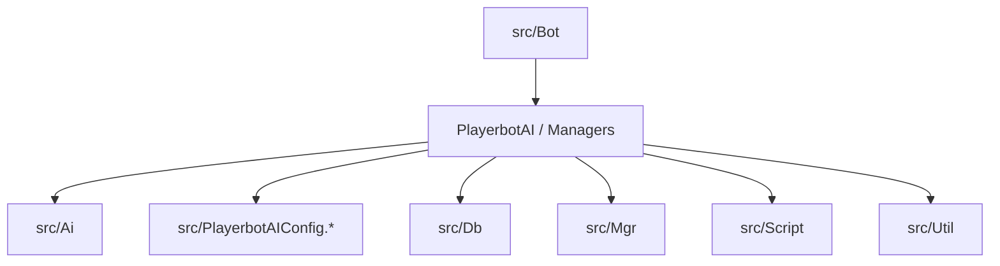

# Phase 0 — Preparation (1–2 hours)

**Deliverable:** a documentation outline and an initial glossary.

## 0.A — Folder map (main roles)

| Folder | Role |
| --- | --- |
| `src/Ai/` | AI logic: strategies, actions, triggers, values, class/dungeon/raid specializations. |
| `src/Bot/` | Bot core: `PlayerbotAI`, bot managers, bot engine factories, command handling. |
| `src/Db/` | Data access and persistence logic for playerbots. |
| `src/Mgr/` | Managers and cross‑cutting systems (services used across bot subsystems). |
| `src/Script/` | Script bindings/integration points with AzerothCore. |
| `src/Util/` | Shared utility helpers used across the module. |
| `src/PlayerbotAIConfig.*` | Central configuration and tunables for bot behavior. |

## 0.B — Glossary (initial)

- **Bot**: A character controlled by `PlayerbotAI` instead of a human player.
- **Master**: The real player controlling one or more bots via commands (linked to `PlayerbotMgr`).
- **Random bot**: Autonomous bot managed by `RandomPlayerbotMgr` (not tied to a master).
- **Strategy**: A behavior bundle registered into an `Engine` (e.g., combat or non‑combat).
- **Action**: A single executable behavior chosen by the `Engine` (cast, move, loot, etc.).
- **Trigger**: A condition that selects which action should run.
- **Value**: A data provider used by triggers/actions (cached computation).
- **Engine**: The decision dispatcher that runs strategies, evaluates triggers, and executes actions.
- **Context (AiObjectContext)**: Factory + registry for actions, triggers, values, and strategies.

## 0.C — Common section format (for all later pages)

Use this structure for every component or subsystem page:

1. **Role**  
   What the component does and when it is used.
2. **Key APIs / classes**  
   The entry points and main classes/functions.
3. **Managed data**  
   State, caches, DB tables, or configuration it owns.
4. **Extension points**  
   Where new logic can be added safely.
5. **Risks / pitfalls**  
   Common mistakes, performance costs, or side effects.
